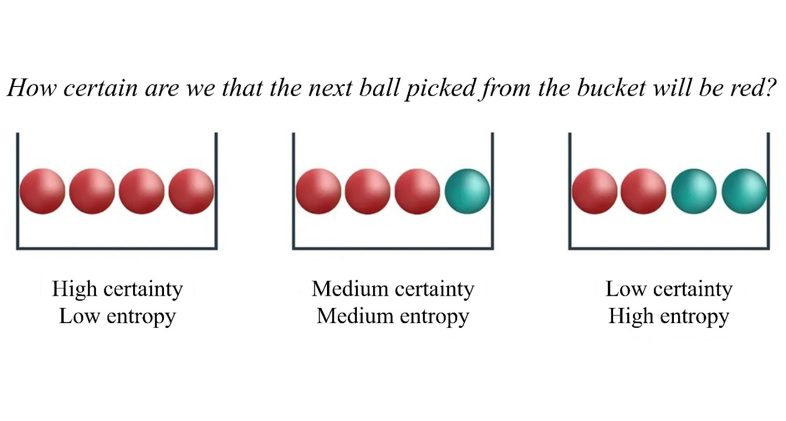
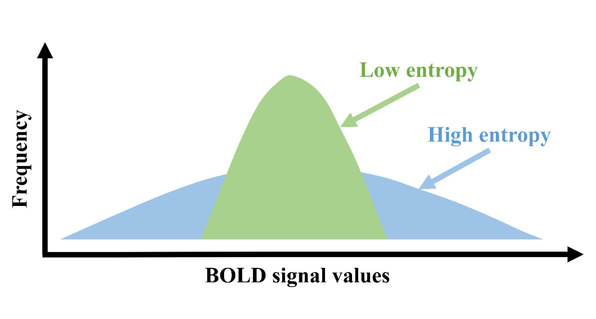
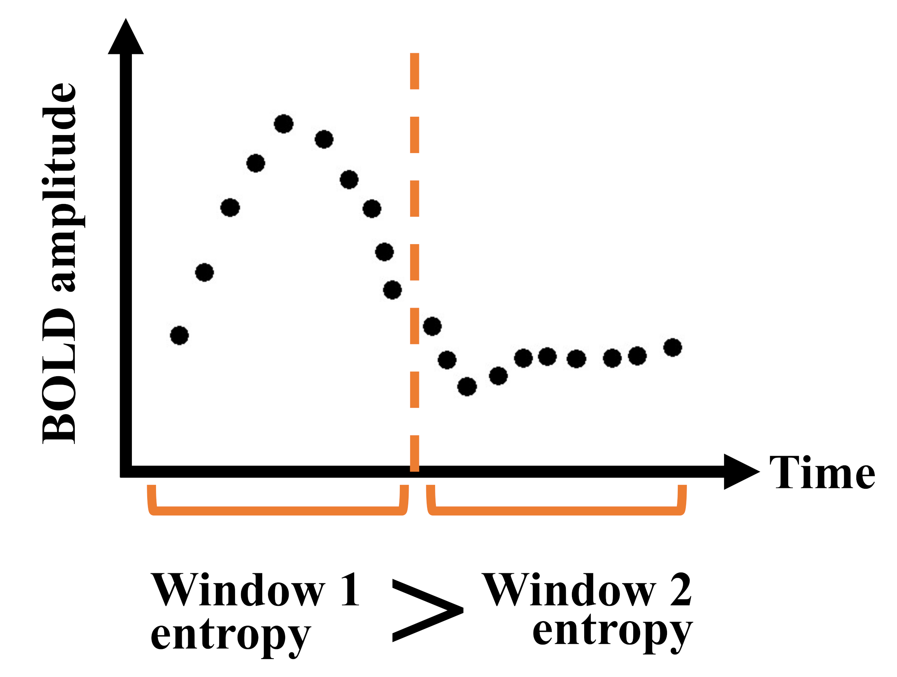
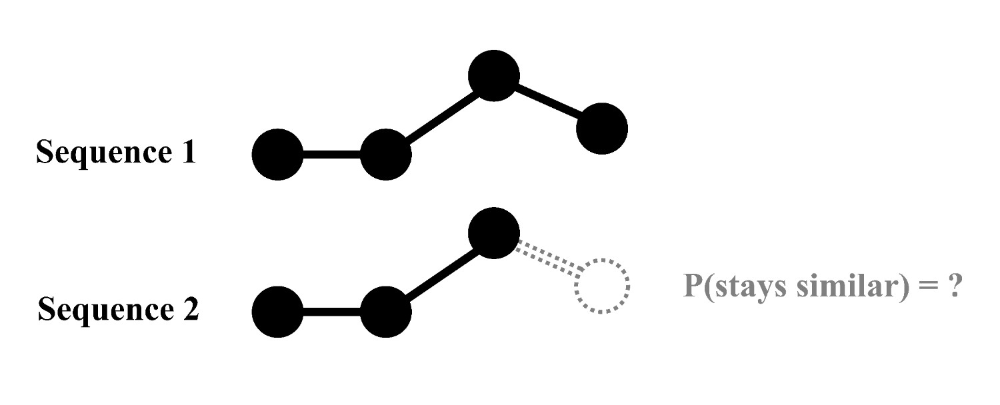
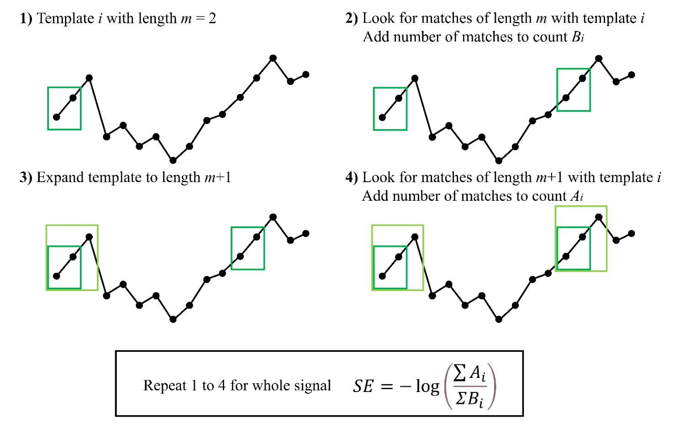
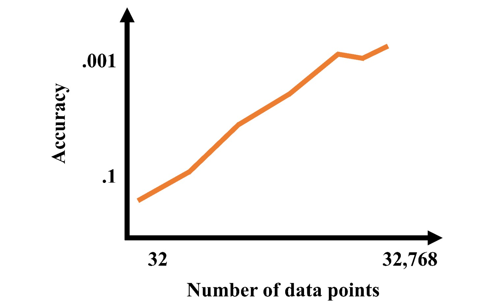
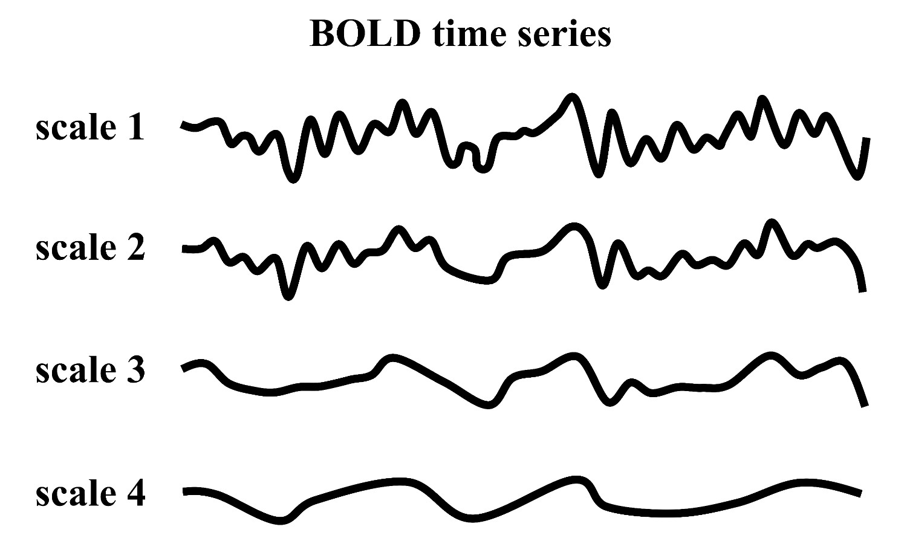
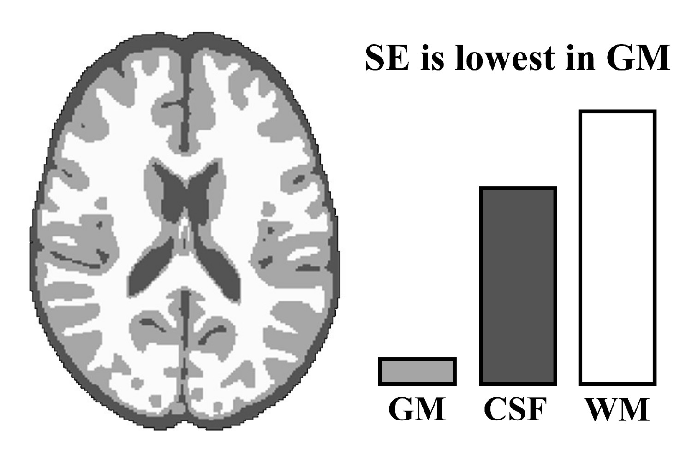
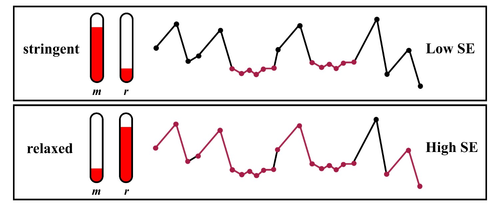
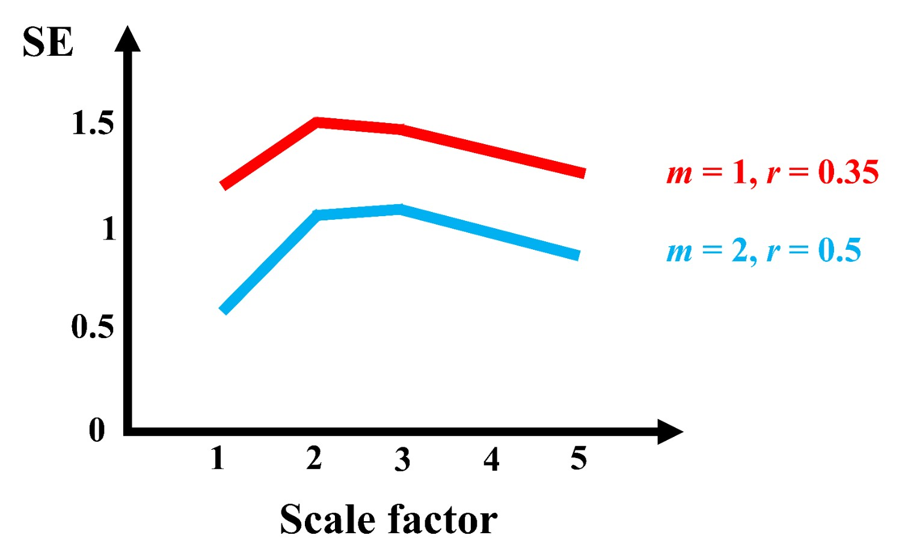

# Introduction

The brain is a complex system that exhibits nonlinear dynamics across multiple dimensions, including the temporal unfolding of its activity. Capturing these dynamics requires more than traditional static summaries of average activity or connectivity. Instead, approaches are needed that explicitly quantify the temporal richness of brain function. One informal grouping of such approaches is temporal complexity (@fig-wordcloud). Temporal complexity metrics reflect diverse assumptions and motivations, but broadly aim to quantify regularity and irregularity in time-series, including features like recurring patterns, memory, and unpredictability [@varleyConsciousnessBrainFunctional2020]. Temporal complexity is the most common of the complex-systems approaches to the brain, and is present across multiple scales, from the cellular to large-scale functional networks (@fig-scales) [@cofreEntropyComplexityTools2025]. 

::: {#fig-wordcloud width=350}

**A variety of approaches to nonlinear analysis of fMRI data.** A Python-generated word cloud of fMRI complexity terms, weighted by number of results in PubMed. Keywords were selected from reviews of nonlinearity/complexity (including @sarassoConsciousnessComplexityConsilience2021, @sunComplexityAnalysisEEG2020, @hernandezBrainComplexityPsychiatric2023, @keshmiriEntropyBrainOverview2020, @donoghueEvaluatingComparingMeasures2024, and @yangMentalIllnessComplex2013). 
:::

{#fig-scales width=450}

Complexity is possibly best conceptualized as involving a delicate balance between order and disorder [@spornsNetworksBrain2010]. Uniform systems (e.g., crystal lattices; sine waves) are not complex, nor are completely irregular ones (e.g., randomly moving particles; white noise); rather, complexity lies between these two extremes, combining predictability and unpredictability [@varleyConsciousnessBrainFunctional2020]. In this model, the brain is considered a dynamical system operating at a phase transition between these two opposing states. At this transition --- called the critical point --- information processing is optimized [@beggsNeuronalAvalanchesNeocortical2003; @marshallAnalysisPowerLaws2016; @carhart-harrisEntropicBrainTheory2014; @carhart-harrisEntropicBrainRevisited2018]. All critical systems display something known as scale-invariance [@hengenCriticalityUnifiedSetpoint2024]. When a system is scale-invariant, it is self-similar across all scales; that is, it has a "fractal" structure, containing meaningful information at every level of magnification. Scale-invariance further implies that the system has memory, with past events influencing the next milliseconds, seconds, and minutes [@hengenCriticalityUnifiedSetpoint2024]. By allowing past information to be used in the future, this "memory" supports optimal information processing [@hengenCriticalityUnifiedSetpoint2024]. 

<!--
{#fig-tempresolution width=450} 
-->

Functional magnetic resonance imaging (fMRI) can indirectly assess temporal complexity in brain activity through the blood-oxygen level dependent (BOLD) signal. Despite the fact that fMRI is traditionally considered unsuitable for rigorous temporal analyses --- its time-series are sampled slowly (0.5--3 s), and are relatively short in length (5--10 minutes), limiting access to fine-scale dynamics and data-hungry metrics [@grandyEstimationBrainSignal2016] --- a growing literature shows that coarse-scale dynamics remain informative. These dynamics have been linked to both cognitive and clinical states and have been reliably characterized using fMRI recordings [@sokunbiBOLDFMRIComplexity2016; @xinApplicationComplexityAnalysis2021].

Compared to other neuroimaging modalities (reviewed in [@sarassoConsciousnessComplexityConsilience2021; @sunComplexityAnalysisEEG2020; @hernandezBrainComplexityPsychiatric2023; @keshmiriEntropyBrainOverview2020; @yangMentalIllnessComplex2013]), however, temporal complexity metrics are seldom used in fMRI research. This is reflected in a diffuse, unstandardized landscape in which methods are siloed across research groups, limiting accessibility and comparability. The present review aims to help bridge this gap. Going beyond previous reviews of complexity in fMRI [@sokunbiBOLDFMRIComplexity2016; @xinApplicationComplexityAnalysis2021], we have attempted to systematically identify all temporal complexity metrics used in fMRI research and all relevant papers that used each metric. To our knowledge, no prior review has undertaken this task at this scope.

We have focused on providing guidance for clinical and cognitive researchers who wish to implement temporal complexity metrics. Many such researchers lack a background in information theory and thus face a choice: either apply temporal complexity measures without fully understanding the theoretical context --- risking methodological or interpretational errors --- or invest considerable time learning about a vast, interdisciplinary, and technically varied literature. Our review aims to solve this problem by serving as both a comprehensive and accessible resource for temporal complexity methods in fMRI.

What follows is first a review of the basic concepts of various temporal complexity metrics and their applications to fMRI, followed by a comparison of these metrics, and finally a discussion that explores their clinical and neuroscience findings. 

# Temporal complexity metrics

In order to get a better sense of temporal complexity, it may help to first describe how it differs from variability. Complexity and variability are statistically distinct, yet closely intertwined: they both describe the temporal dynamics of a signal, with variability describing signal spread, and complexity describing within-series interactions and recurring patterns (@fig-variability). A time-series that is more complex is not necessarily more variable, and vice versa. Nevertheless, complexity and variability are closely related. Indeed, some measures of complexity explicitly make use of variability as a measure across different scales (e.g., approximate entropy [@richmanPhysiologicalTimeseriesAnalysis2000] or rescaled range to measure the Hurst exponent [@hurstLongTermStorageCapacity1951]). Furthermore, across theoretical perspectives, changes in a system (i.e. it's variance) are fundamentally related to the complexity of its behaviour [@lotfiStatisticalComplexityMaximized2021; @garrettMomenttomomentBrainSignal2013; @chialvoLifeEdgeComplexity2018; @heScaleFreePropertiesFunctional2011]. Intuitively, a system cannot exhibit complex behaviour if its variability is either minimal or maximal --- that is, if it is in complete stasis or fluctuates completely randomly. 

{#fig-variability width=450}

<!-- There is a growing literature on signal variability. Briefly: Variability is essential to brain function (Garrett et al., 2013; Baracchini et al., 2023). Measures of temporal signal variability are relevant to cognition, lifespan development, and disease (Steinberg & King, 2024; Goodman et al., 2024; Chen et al., 2022; Wei et al., 2023). These measures include variance (He, 2011), standard deviation (SD; the square root of the variance; Garrett et al., 2010), and mean square successive differences (similar to variance, but comparisons are made between adjacent time-points in the series; Leo et al., 2012; Afyouni & Nichols, 2018). -->

 <!-- From a complex-systems perspective, complexity relies on a particular degree of variability, with both minimal variability (i.e., complete order) and maximal variability (i.e., complete randomness) being associated with low complexity (e.g., Lofti et al., 2021; Garrett et al., 2013; Chialvo, 2018; He, 2011; Steinberg & King, 2024; Goodman et al., 2024). Note that the terms complexity and variability are nonetheless sometimes used interchangeably (e.g., Jaworska et al., 2018).--> 

## Hurst exponent

As mentioned previously, a complex system will display a fractal structure that is composed of smaller parts that exhibit the same pattern at every scale [@kochCourbeContinueSans1904; @kochMethodeGeometriqueElementaire1906; @mandelbrotHowLongCoast1967]. Classic spatial examples of fractals in nature are coastlines [@mandelbrotHowLongCoast1967], circulatory system [@jayalalithaFractalModelBlood2008], and brain anatomy [@ansellUnveilingUniversalAspects2024], where at each level of magnification these structures look the same; i.e. *self-similarity* (See @fig-sierpinskitriangle for an idealized mathematical example). For a dynamic process, or in the temporal domain, this is known as *scale invariance*, meaning that both rapid and slow processes follow the same pattern [@rileyTutorialIntroductionAdaptive2012]. Scale invariance exhibits a gradual decay in its autocorrelation function, known as scale-free long-range temporal correlations (LTRCs). LTRCs are foundational to the measurement of temporal fractality as they indicate that the system maintains a long-lasting, multiscale memory of its past states, which play a role in shaping its present and future behaviour.

::: {#fig-sierpinskitriangle width=350}

**Ideal mathematical fractal.** The 2D Sierpinski triangle starts with a simple equilateral triangle (left), and subdivides it recursively into smaller equilateral triangles. For every iteration, each triangle (in blue) is further subdivided it into four smaller congruent equilateral triangles with the central triangle removed. The first such iteration is shown in the centre, with the fifth iteration shown on the right.
:::

The Hurst exponent (HE) is a statistical measure used to quantify persistence in time-series data. First introduced by Harold Hurst in 1951 for hydrological applications [@hurstLongTermStorageCapacity1951], it was Benoit Mandelbrot who helped popularize its use for studying complex shapes and forms of nature [@mandelbrotClasseProcessusStochastiques1965; @mandelbrotHowLongCoast1967]. Since then it has been applied across various fields, including finance, geophysics, ecology, and neuroscience, to characterize complex systems with intricate dynamics [@molzFractionalBrownianMotion1997; @korvinFractalModelsEarth1992; @parkSelfSimilarNetworkTraffic2000; @gravesBriefHistoryLong2017].

HE is a real number between 0 and 1 (non-inclusive; although it can be extended to > 1; see @ekePhysiologicalTimeSeries2000 and @hartmannRealtimeFractalSignal2013).
When HE = 0.5, the time-series is completely uncorrelated, has no memory, and is like white noise (purely random). It represents the highest level of unpredictability and entropy, but not necessarily the most complex state in a physiological sense. When HE < 0.5, the time-series is said to be anti-persistent, exhibiting negative correlations: i.e. if the signal increases at one point, it's likely to decrease at the next point. This is also known as short-term reversal. This tends to make the time-series more predictable and reduces randomness, often simplifying dynamics. When HE > 0.5, the time-series exhibits positive long-range correlations, and is more structured. The time-series displays a long-term trend, meaning past states influence future states.

There are four main properties that must be present for a time-series to be characterized by HE: 1) self-similarity; 2) power law scaling relationship; 3) scale-invariance; and 4) a scaling range (@fig-fourprop). Self-similarity means that pieces of the structure, when enlarged, resemble larger pieces or the whole (@fig-statisticalfractal and @fig-fourprop A-C). This is because in one direction (time) the proportions between the enlarged pieces is different than in the other (amplitude of signal; e.g. fMRI BOLD) [@ekePhysiologicalTimeSeries2000]. A discussion of these four properties are explored further in @sec-hurstprop.

{#fig-statisticalfractal width=350}

::: {#fig-fourprop width=450}

**Main properties of a fractal time-series** A-C show a raw time-series (fractional Gaussian noise in this example) at different scales: B is the first half of A (shown as vertical dashed lines in A), while C is half of B (shown in vertical dashed lines in B). D is a power spectral density plot of A. E shows D but on a log-log plot, demonstrating the linear nature of fractal signals when plotted on a log-log scale. The slope of E is $-\beta$. In this example, $\beta$ is calculated to be 0.6, which translates to an H of 0.8. F shows a modified version of E, which imagines that E only demonstrates a power law scaling relationship between two distinct frequencies. The equation for calculating the scaling range in decades is shown. Exact fractal time-series (A) was created using the Davies-Harte method.
:::
<!-- TODO: fix A and B, maybe make the horizontal lines different colors --> 

Fractal signals can be organized into two distinct kinds: fractional Gaussian noise (fGn) and fractional Brownian motion (fBm) @fig-typicalsamplepaths [@mandelbrotFractionalBrownianMotions1968]. fGn signals are stationary, meaning they tend to center along a mean and variance value over time. In contrast, fBm signals are non-stationary: their values tend to wander away from the mean, and their variance is a power function of the time span over which it is computed. Curiously, fGn and fBm can easily be converted from one to the other: fGn to fBm by applying a successive summation between elements of the fGn series; and fBm to fGn by applying successive differences between elements of a fBm series.

::: {#fig-typicalsamplepaths width=450}

**Simulated fractional Gaussian noise and fractional Brownian motion.** Raw simulated time-series with 1,024 time-points and known Hurst values are plotted on the left. The top three time-series are fractional Gaussian noise, while the bottom three are fractional Brownian motion. H values are displayed on the left, while $\beta$ values are displayed on the right. Note how fractional Gaussian noise remain centered around a mean (i.e. stationary), while fractional Brownian motion wanders away from the mean (i.e. non-stationary). Log-log power spectral density plots of the signals on the left are shown on the right. Linear-regression fits are shown in red, which are used to calculate $\beta$ and H using the appropriate equation (on the right). Exact fractal time-series were created using the Davies-Harte method. Figure inspired by @ekePhysiologicalTimeSeries2000.
:::

When estimating the HE of a signal, it is imperative to first classify the signal as either fGn or fBm. Failure to do so can result in serious miscalculation of HE, as different estimators can produce extremely biased calculations depending on the assumed type of signal. The distinction between fGn and fBm can be seen in their spectral properties. The fourier transform of fGn signals follow a power-law form: $|A(f)|^2 \propto f^{-\beta}$, where the exponent $\beta$ ranges between -1 and 1. This is known as $1/f$ noise, as the power is inversely proportional to frequency. fBm, being a cumulative sum of fGn, has a different spectral behaviour: $|A(f)|^2 \propto f^{-(\beta + 2)}$. This steeper decay ($\beta + 2$) causes fBm to exhibit stronger low-frequency dominance, making it distinct from $1/f$ noise. Thus, when $\beta \sim 1$, a signal is said to exist on the $1/f$ boundary.

One method of calculating HE, known as the spectral method or periodogram method, is based on creating a power spectral density (PSD) plot; basically a fourier transform. The periodogram method involves creating a log-log plot of the PSD 
@fig-fourprop D and E), calculating the linear-regression slope ($-\beta$), and, depending on the slope angle, using one of two equations:

$$
HE =
\begin{cases}
\frac{\beta + 1}{2}, & \text{if } -1 < \beta < 1 \\
\frac{\beta - 1}{2}, & \text{if } 1 < \betax < 3
\end{cases}
$$ {#eq-psdH}

See @fig-typicalsamplepaths.

Several methods have been proposed for classifying fGn and fBm signals, including ones that make use of the periodogram method [@ekePhysiologicalTimeSeries2000; @ekeFractalCharacterizationComplexity2002], detrended fluctuation analysis (DFA) [@pengLongrangeAnticorrelationsNonGaussian1993], autoregressive
fractionally integrated moving average (ARFIMA) [@grangerINTRODUCTIONLONGMEMORYTIME1980], and wavelet entropy [@ramirezpachecoDistinguishingStationaryNonstationary2012; @ramirez-pachecoClassificationFractalSignals2017]. These methods, however, all struggle to distinguish signals whose PSD $\beta$ values are $\sim$ 1 [@ekePhysiologicalTimeSeries2000] (AKA the $1/f$ boundary).

HE estimation algorithms vary in performance, assumptions, and limitations. In order to avoid biasing ones results, it is important to choose the right method carefully, especially when applied to physiological signals which can be contaminated by non-physiological noise. Despite their diversity, all approaches employ a version of scale-invariance analysis, by fitting a log feature versus log scale for finding a scaling exponent from a regression slope, and then calculating HE from this scaling exponent. A non-exhaustive list of HE estimators that use the time-domain include: rescaled range analysis [@hurstLongTermStorageCapacity1951]; dispersional analysis [@bassingthwaightePhysiologicalHeterogeneityFractals1988]; scaled window variance; generalized hurst exponent; triangle total areas; Higuchi method; central estimation; detrended fluctuation analysis; least squares method via standard deviation; least squares method via variance; and Whittle's estimator. Hurst estimators that use the frequency-domain include the periodogram method; Welch's technique; and local Whittle. Finally, some examples that are a mixture of time and frequency include: average wavelet coefficient; variance versus level; maximum likelihood in the wavelet domain. For a head-to-head comparison of how these algorithms perform in fMRI data, see @rubinOptimizingComplexityMeasures2013. Examples of how to calculate HE using these algorithms can be found in @zhangTypicalAlgorithmsEstimating2024.
<!-- TODO: add references and Python reference --> 

A summary of fMRI HE studies can be found in @tbl-fmrihurst.

| Study | n | Age range | Methods | Volumes | TR (s) | Results |
|-- | -- | -- |-- |-- | -- | ----- |
| @akhrifFractalAnalysisBOLD2018 | 103 | 19-28 | AFA | task: 425, resting: 350 | 2 | impulsivity: $\downarrow$ |
| @barnesEndogenousHumanBrain2009 | 14 | 21-29 | MLW | 2048 | 1.1 | cognitive effort: $\downarrow$ H |
| @campbellFractalBasedAnalysisFMRI2022 | 72 | mean 29 | PSD~Welch~ | 900 | 1 | movie-watching: $\uparrow$ H in visual, somatosensory, and dorsal attention; $\downarrow$ frontoparietal and DMN |
| @churchillScalefreeBrainDynamics2015 | 97 (28 chemo; 37 radiation; 32 HC) | n/a | DFA, Wavelet | 285 | 1.5 | worry: $\downarrow$ H |
| @churchillSuppressionScalefreeFMRI2016 | three datasets (98): 19; 49; 30 | 20-82 | DFA, PSD~Welch~ | $\sim$ 300 | 2 | age, task novelty and difficulty: $\downarrow$ H |
| @ciuciuInterplayFunctionalConnectivity2014 | 17 | 18-27 | Wavelet | 194 | 2.16 | networks |
| @donaTemporalFractalAnalysis2017 | 71 (56 ASD; 15 HC) | mean 13 | PSD, DA, SWV | 300 | 2 | ASD: $\uparrow$ H |
| @donaFractalAnalysisBrain2017 | 110 (55 mTBI; 55 HC) | mean 13 | PSD, DA, SWV | 180 | 2 | mTBI: $\uparrow$ H |
| @dongHurstExponentAnalysis2018 | 116 | 19-85 | RS | 260 | 2.5 | age: $\uparrow$ H frontal and parietal lobe; $\downarrow$ H insula, limbic, occipital, temporal lobes |
| @drayneLongrangeTemporalCorrelation2024 | 98 | preterm | PSD~Welch~ | 100 | 3 | preterm: $\downarrow$ H; differentiates networks |
| @erbilScaleFreeDynamicsRestingState2025 | 7 | 21-28 | Wavelet | 1,000; 1,000, 3,000 | 1; 0.6; 0.2 | microstates |
| @gaoTemporalDynamicsSpontaneous2018 | 110 | mean 21 | PSD, Wavelet | 232 | 2 | reappraisal scores: $\downarrow$ H |
| @gaoTemporalDynamicPatterns2023 | 195 (100; 95) | 18-28 | Wavelet | ? | 2 | rumination: $\uparrow$ H |
| @gentiliNotOneMetric2017 | 31 | mean 25 | Wavelet | 512 | 1.64 | neuroticism: $\downarrow$ | 
| @gentiliPronenessSocialAnxiety2015 | 36 | mean 27 | Wavelet | 450 | 2 | social anxiety: $\uparrow$ H |
| @heScaleFreePropertiesFunctional2011 | 17 | 18-27 | DFA, PSD | 194 | 2.16 | task: $\downarrow$ H; differentiates networks; brain glucose metabolism and neurovascular coupling |
| @jagerDecreasedLongrangeTemporal2024 | 40 (20 task; 20 no task) | 20-32 | DFA | 512 | 1.13 | motor sequence learning: $\downarrow$ H |
| @laiShiftRandomnessBrain2010 | 63 (33 ASD; 3- HC) | n/a | Wavelet | 512 | 1.3 | ASD: $\downarrow$ H |
| @leiExtraversionEncodedScalefree2013 | 17 | 18-29 | Wavelet | 200 | 1.5 | extroversion: $\downarrow$ H in DMN |
| @leiFadedCriticalDynamics2021 | 75 (16 HMMD; 34 IMMD; 25 HC) | mean $\sim$ 41 | RS | 240 | 2 | moyamoya disease: $\downarrow$ H |
| @linkeAlteredDevelopmentHurst2024 | 83 | 1.5-5 | WML | 400 | 0.8 | age of children ASD: $\downarrow$ H in vmPFC |
| @maximFractionalGaussianNoise2005 | 21 | n/a | LW, Wornell, MLW | 150 | 2 | AD: $\uparrow$ H |
| @mellaTemporalComplexityBOLDsignal2024 | 716 | preterm | PSD~Welch~ | 2,300 | 0.392 | preterm: $\downarrow$ H; H starts < 0.5 at preterm age ; differentiates networks | 
| @omidvarniaAssessmentTemporalComplexity2021 | 100 | 22-35 | PSD, DFA | min 250 | 0.72 | cognitive load: $\downarrow$ H; H and entropy-based complexity highly correlated; H highest in frontoparietal network and default mode network | 
| @rubinOptimizingComplexityMeasures2013 | 22 | ? | Many | ? | ? | HFFT and PSD~Welch~ outperform other methods |
| @sokunbiNonlinearComplexityAnalysis2014 | 29 (13 SZ; 16 HC) | ? | DA, DFA | ? | ? |  SZ: $\downarrow$ H |
| @sucklingEndogenousMultifractalBrain2008 | 22 (11 old; 11 young) | 22 and 65 | MLW | 512 | 1.1 | multifractal reanalysis of [@winkAgeCholinergicEffects2006] |
| @teterevaVarianceScaleFreeProperties2020 | 23 | mean 23.9 | DFA | 300 | 2 | fear: $\downarrow$ H then $\uparrow$ H |
| @uscatescuUsingExcitationInhibition2022 | 124 (55 TD; 30 AT; 39 SZ) | ? |  Wavelet | 947? | 0.475 |  ASD and SZ: $\downarrow$ H |
| @varleyFractalDimensionCortical2020 | 33 (15 HC; 10 min conscious; 8 veg) | ? | HFD | ? | ? |  Lower consciousness: $\downarrow$ H |
| @vonwegnerMutualInformationIdentifies2018 | ? | ? | Wavelet, DFA | 1500 | 2.08 | multiscale variance effects produce Hurst phenomena without long-range dependence |
| @warsiCorrelatingBrainBlood2012 | 46 (33 AD; 13 HC) | ? | PSD, RD | 2,400 | 0.25 | AD: $\uparrow$ H |
| @weberPreliminaryStudyEffects2014 | 14 | 22-38 | Wavelet | 512 | 2 | acute alcohol intoxication: mix of $uparrow$ and $downarrow$ H |
| @winkAgeCholinergicEffects2006 | 22 (11 old; 11 young) | 22 and 65 | MLW | 512 | 1.1 | age: $\uparrow$ H in bilateral hippocampus; scopolamine: $\uparrow$ H; faster task: $\uparrow$ H |
| @winkMonofractalMultifractalDynamics2008 | 11 | mean 35 $\pm$ 10 | Wavelet | 136 | 1.1 | latency in fame decision task: $\downarrow$ H |
| @xiePharmacoresistantTemporalLobe2024 | 70 | ? | Wavelet | 700 | 0.6 | pharmaco-resistant TLE: $\downarrow$ H |

: **fMRI-Hurst studies.** An attempt to gather all published fMRI studies that have used Hurst or Hurst-like analysis, some stats, and the main findings. Main findings are almost certainly more nuanced than how we have reported them here; we have attempted to condense the findings as succinctly as possible. n = number of subjects in the study; TR = repition time; MLWD = maximum likelihood wavelet; PSD~Welch~ = power spectral density Welch method; DMN = default mode network; DFA = detrended fluctuation analysis; DA = dispersional analysis; SWV = scaled window variance; RS = rescaled range; LW = local Whittle. {#tbl-fmrihurst}

## Lempel-Ziv complexity

Lempel-Ziv complexity (LZC) estimates somehting called Kolmogorov complexity [@zenilReviewMethodsEstimating2020]. Kolmogorov complexity originates from computer science and is a measure of the computational resources needed to specify an object --- for instance, the length of the shortest computer program required to generate a patterned series. The Lempel-Ziv algorithm parses the time-series, identifying the number of unique patterns that make up the signal. Sequences with a small number of unique patterns (low LZC) are considered less complex, while sequences with a large number of unique patterns (high LZC) are considered more complex [@lempelComplexityFiniteSequences1976] (@fig-lzc).

![A computation of LZC that is representative of the fMRI literature [@varleyConsciousnessBrainFunctional2020; @golesorkhiTemporalSpatialTopography2022]. Figure created using R Statistical Software (v4.4.3; R Core Team 2021) and based on @golesorkhiTemporalSpatialTopography2022. 1) The median of the time-series is calculated. 2) The series is binarized, such that time-points above the median are represented by 1 and time-points below are represented by 0. 3) This results in a single vector. 4) The Lempel-Ziv algorithm is applied to the vector. This algorithm parses the vector to identify recurring, increasingly long patterns, and adds each identified pattern to a "dictionary." The length of the dictionary is the classic Lempel-Ziv output. 5) Because this length is dependent on the length of the input time-series, the output is normalized (for example, by a factor obtained by running the LZ algorithm on a shuffled version of the input, or by the length of the original sequence).](./images/300_dpi/Fig16.png){#fig-lzc width=450}

Over the past two decades, LZC has been the most common measure of complexity in temporally rich modalities (i.e., EEG, MEG, and ECoG) [@medianoSpectrallyTemporallyResolved2023]. In fMRI, one challenge is that the Lempel-Ziv algorithm can only be performed with a long time series, but fMRI runs are often short (around 100-500 volumes). Some fMRI analyses therefore compute Lempel-Ziv from concatenated time-series from multiple voxels or regions --- a process called concatenated LZC [@medianoFluctuationsNeuralComplexity2021; @tokerConsciousnessSupportedNearcritical2022; @varleyConsciousnessBrainFunctional2020].

To date, LZC has seldom been used in fMRI. To our knowledge, the only fMRI temporal LZC studies are @catalIntrinsicHierarchySelf2022, @golesorkhiTemporalSpatialTopography2022, and @medianoFluctuationsNeuralComplexity2021. Nevertheless, LZC is an effective metric; notably, @varleyConsciousnessBrainFunctional2020 found that LZC was one of the metrics most correlated with the first principal component extracted from a full sample of complexity metrics, indicating that LZC robustly indexes complexity.

## Lyapunov exponent

The Lyapunov exponent captures the sensitivity of a dynamical system to initial conditions, describing the rate at which initially close trajectories diverge [@wolfDeterminingLyapunovExponents1985]. Rapid divergence implies amplification of perturbations and reduced predictability, making the Lyapunov exponent an index of chaotic dynamics. It is widely used in EEG [e.g., @simoesHowMuchBOLDfMRI2020] and has been used to investigate spatial patterns in structural MRI data [@liuAlteredBrainComplexity2024], but applications to fMRI time series thus far are limited [@keilholzRelationshipBasicProperties2020; @majidReducedBrainEntropy2025; @lairdInvestigatingNonlinearityFMRI2002; @arlenexfangLyapunovExponentAnalysis2017]. 

In previous applications to fMRI time series [@keilholzRelationshipBasicProperties2020; @majidReducedBrainEntropy2025], computing the Lyapunov exponent has involved first reconstructing the phase space dynamics of the system from the time series by embedding the unidimensional series in higher-dimensional space. Concretely, the time series is converted to a vector of differences (termed lags), and the embedding dimension is selected using a data-driven algorithm (e.g., False Nearest Neighbors). The relationship between initial conditions $\delta_{0}$ in phase space and the rate of divergence over time $\delta (t)$ is exponential: $\lvert \delta (t) \rvert \approx {\rm e}^{\lambda t} \lvert \delta_{0} \rvert$, where $\lambda$ is the Lyapunov exponent.

Because the rate of separation can differ along different orientations, a spectrum of Lyapunov exponents is produced, with one exponent per dimension. The largest Lyapunov exponent (LLE) best represents the system's behaviour, and thus is conventionally reported. Positive LLE values indicate that the system is chaotic, values near zero represent neutral dynamics, and negative values represent stability. For the short and noisy series characteristic of fMRI, the LLE is biased towards low-positive values and cannot be interpreted as representing anything more than weak chaoticity [@majidReducedBrainEntropy2025].

## Entropy measures

Entropy, in the context of time-series and brain signals, is a measure of uncertainty, irregularity, or unpredictability in a signal. It originates from information theory and statistical mechanics, but has been adapted into many specialized forms for analyzing neural dynamics. It is by far the most popular and diverse measure we encountered in our literature search, and is thus one of the bigger sections in our review.

### Shannon entropy

Shannon entropy serves as the foundation for virtually all contemporary entropy measures, and its introduction marked the birth of information theory [@shannonCommunicationPresenceNoise1949]. Shannon entropy quantifies uncertainty; it can be thought of as the difficulty of predicting an observation's value (@fig-entropyuncertainty). Applied to a time-series, it measures the minimum number of 'bits' needed to encode the series based on the frequency of values (@fig-entropybolddistribution).

{#fig-entropyuncertainty width=450}

{#fig-entropybolddistribution width=450}

Shannon entropy can be calculated using the following equation:

$$
H = - \sum_{i=1}^{N}p_{i}\log(p_{i})
$$ {#eq-shannonentropy}

where $H$ is entropy and $p_{i}$ is the frequency of a given value.

Shannon entropy is seldom used to assess the temporal complexity of neuroimaging time-series. Instead, it is most commonly applied to spatiotemporal properties—for example, to quantify the complexity of functional connectivity (FC) [@violShannonEntropyBrain2017; @pappasBrainNetworkDisintegration2019]. This is because the classic formulation only considers frequency values, not their order. The resulting metric is poorly suited to describe how a series changes over time. Only one study, by @huangDefaultModeNetwork2025, used Shannon entropy of frequency of values (details in discussion). However, several studies have applied Shannon entropy to wavelet-decomposed time-series (i.e., analyzing the entropy of different frequency bins; method described in @rossoWaveletEntropyNew2001), which has been shown to be an improvement over the classic formulation. For example, @guptaWaveletEntropyBOLD2017 found that Shannon wavelet entropy was able to discriminate epilepsy patients from controls, whereas classical Shannon entropy was not.

Although Shannon entropy is rarely applied with the explicit aim of describing temporal complexity, it has been used as an innovative alternative to traditional methods of analyzing event-related fMRI data. Unlike traditional methods, entropy makes no assumptions about the shape of the evoked hemodynamic response, which can improve stability and sensitivity [@mikolasAnalysisFMRITimeseries2012; @ostwaldInformationTheoreticApproaches2011]. @dearaujoShannonEntropyApplied2003 were the first to apply Shannon entropy to event-related fMRI analysis. They calculated entropy within time-windows during activation and rest; the rise and fall of the entropy measure mirrored the theoretical hemodynamic response (@fig-shannonentropyevents). Compared to traditional cross-correlation, Shannon entropy was more stable with a changing signal-to-noise ratio [@dearaujoShannonEntropyApplied2003]. @dinuzzoTemporalInformationEntropy2017 also used Shannon entropy in event-related analysis, which allowed them to capture changes induced by photic stimulation that were missed by traditional temporal descriptors (e.g., variance). Together, these results indicate that Shannon entropy may capture features of BOLD dynamics that escape conventional temporal measures. More broadly, this demonstrates the usefulness of temporal dynamics in situations where spatial maps are unable to fully capture condition differences.

{#fig-shannonentropyevents width=450}

<!-- Several extensions to Shannon entropy have been introduced as alternatives to conventional methods for discriminating task conditions in event-related fMRI. A comprehensive list of these methods and their applications is as follows: Tsallis entropy (applied by [@sturzbecherNonextensiveEntropyExtraction2009; @wangInvestigatingUnivariateTemporal2013], Renyi entropy [@gonzalezandinoMeasuringComplexityTime2000; @wangInvestigatingUnivariateTemporal2013], generalized relative entropy [@cabellaGeneralizedRelativeEntropy2009; @welvaertHowIgnoringPhysiological2012], adaptive entropy rate [@fisherAdaptiveEntropyRates2001], and time-lagged mutual information [@tsaiAnalysisFunctionalMRI1999; @fuhrmannalpertSpatiotemporalInformationAnalysis2007; @alpertTemporalCharacteristicsAudiovisual2008; @tedeschiGeneralizedMutualInformation2004; @tedeschiGeneralizedMutualInformation2005; @vonwegnerMutualInformationIdentifies2018]. Despite their potential effectiveness in event-related fMRI analysis, these methods have not been widely adopted, neither since they were first reviewed by @mikolasAnalysisFMRITimeseries2012, nor in the decade since. This may be because of their high computational demands or simply because there are better approaches to model-free hemodynamic response estimation (e.g., finite-impulse-response models [@metzakConstrainedPrincipalComponent2011]. No studies have systematically evaluated whether Shannon-entropy-based analysis methods discriminate task conditions better than conventional ones, which leaves a knowledge gap. -->

### Kolmogorov-Sinai entropy

In contrast to Shannon entropy, Kolmogorov-Sinai (KS) entropy takes time into account (@fig-ksentropy), allowing for application to dynamical systems [@nogueiraExploringLinkMultiscale2017]. As a system evolves, KS entropy quantifies the average rate at which information is produced with each new state; that is, it quantifies the difficulty of predicting future observations given past observations. Higher KS entropy implies that a higher amount of information is being introduced at each time-point, meaning that the series is more unpredictable. Like Shannon entropy, KS entropy implements the intuitive notion that a broader distribution of data values should correspond to greater uncertainty. 

{#fig-ksentropy width=450}

KS entropy is difficult to apply to real-world data, given that proper implementation requires exceedingly large amounts of time-series data and an absence of noise [@pincusApproximateEntropyMeasure1991; @richmanPhysiologicalTimeseriesAnalysis2000]. As such, a variety of measures have been developed as approximations for KS entropy. The following sections discuss approximations of KS entropy that have been applied to fMRI research.

### Approximate entropy

In fMRI, nearly all approximations of KS entropy can trace their historical lineage to approximate entropy (ApEn) [@pincusApproximateEntropyMeasure1991]. First used on cardiovascular time-series and later adapted for neuroimaging [@richmanPhysiologicalTimeseriesAnalysis2000; @bruhnApproximateEntropyElectroencephalographic2000], ApEn quantifies the probability that sequences of similar patterns in a time-series will remain similar when sequence length is increased. A higher value of ApEn signifies that the signal contains fewer repeating patterns—that is, greater complexity.

In the calculation of ApEn, each sequence is counted as matching itself [@richmanPhysiologicalTimeseriesAnalysis2000]. This nuance leads to two limitations. First, it causes ApEn to be lower than expected for shorter time-series [@richmanPhysiologicalTimeseriesAnalysis2000]. This is because counting self-matches inflates the estimation of regularity, and this over-inflation is more prominent for short series. Shortening datasets (e.g., by using one fMRI run instead of two) may change ApEn despite identical patterns. Second, ApEn lacks relative consistency, meaning that comparisons between datasets can be affected by the choice of time-window and tolerance parameters (i.e., if ApEn is higher for one dataset than another using one set of parameters, we would expect this to remain true for other choices of parameters, but this is not the case; [@richmanPhysiologicalTimeseriesAnalysis2000]). 

Given these limitations, ApEn is rarely used to characterize temporal complexity in fMRI. In most fMRI studies, ApEn is reported only alongside other entropy-based measures --- such as sample entropy (SE) or fuzzy approximate entropy --- and therefore these applications are included in our "Comparisons of All Metrics" section. Two ApEn studies that do not appear in that section are @sokunbiInterindividualDifferencesFMRI2011 and @liuComplexitySynchronicityResting2013; both report clinical findings that align with the broader complexity literature, and we summarize these in the Discussion.

### Sample entropy

Sample entropy (SE) was developed to correct ApEn's limitations [@richmanPhysiologicalTimeseriesAnalysis2000]. The difference between the calculation of SE and that of ApEn is that SE doesn't count self-matches in the conditional probability, which corrects the two limitations described in the ApEn section [@richmanPhysiologicalTimeseriesAnalysis2000] (for an example in fMRI, see [@yangStrategyReduceBias2018]. In addition to these advantages, SE is a better approximation of KS entropy and is simpler to compute [@richmanPhysiologicalTimeseriesAnalysis2000]. Accordingly, SE is more widely used than ApEn in fMRI and can be computed using the toolboxes `BENtbx` [https://github.com/zewangnew/BENtbx; e.g., Wang et al., 2014](https://github.com/zewangnew/BENtbx) (e.g., @wangBrainEntropyMapping2014) or `Complexity Toolbox` [http://loft-lab.org/index-5.html; e.g., Zhang et al., 2021](http://loft-lab.org/index-5.html) (e.g., @zhangAlteredComplexitySpontaneous2021). SE is most often called "brain entropy" (BEN) [@wangBrainEntropyMapping2014]; however, because BEN can also refer to Shannon entropy [@akdenizComplexityAnalysisRestingState2017], we elected to use the term SE in this review.

To calculate SE, the user specifies two parameters: the time-window $m$ and the tolerance scale $r$. $m$ is the number of values to be analysed at a time, and $r$ is the multiplied by the standard deviation (SD) of the series to obtain the tolerance. SE is equal to the negative average natural logarithm of the conditional probability that two sequences that are similar (i.e., within the tolerance) for $m$ points will stay similar for $m+1$ points [@richmanPhysiologicalTimeseriesAnalysis2000]. Because conditional probability is between 0 and 1, SE will always be positive. When the time-series is highly regular (i.e., when similar runs remain similar), SE is low; when the time-series is irregular, SE is high [@pincusApproximateEntropyMeasure1991]. See @fig-sampleentropyconceptual for a conceptual explanation, @fig-sampleentropycomputational for a computational explanation, and @delgado-bonalApproximateEntropySample2019 for a tutorial. For a detailed guide to selecting $m$ and $r$, see @sec-appendixa1 and @suppfig-stringent.

{#fig-sampleentropyconceptual width=450}

{#fig-sampleentropycomputational width=450}

What is the minimum number of time-points needed for SE? In general, more time-points improve results. For example, using simulated data, @grandyEstimationBrainSignal2016 found that SE accuracy and precision increased fairly linearly from the shortest to longest series tested (32 to 32,768). @wehrheimReliabilityVariabilityComplexity2024 (@fig-SEtimepoints) observed strong (albeit non-significant) correlations between reliability and series length, including a slow increase in split-half correlation from the shortest to longest series tested (100-800), along with a steady increase in test--retest correlation that plateaued around 500. Highlighting that the relationship between length and reliability is dataset--dependent, they found differences in rest versus task data (for a wide variety of tasks, including cognitive, motor, and social). As for the lower limit of length, @yangStrategyReduceBias2018 identified a lower bound of 97 time-points; for series shorter than 97, SE could still be calculated, but with a narrower range of $m-$ and $r-$values. @sokunbiSampleEntropyReveals2014 found that SE discriminated between young and old adults in series as short as 85 in a small (n = 20) cohort. Again highlighting that length limitations are dataset-dependent, @sokunbiSampleEntropyReveals2014 found that more data points were needed in a larger (n = 86) cohort (potentially because the smaller cohort had low inter-individual variability). 

{#fig-SEtimepoints width=450}

Several innovations to SE have been made in recent years. @delmauroCrosssubjectBrainEntropy2024 introduced "cross" SE, a method for comparing multiple SE maps which can be applied to make comparisons between subjects, sessions, scan times, or regions. Thus far, cross entropy has been used to show a decoupling between the (across-subject) mean and variance of SE across different brain regions [@delmauroCrosssubjectBrainEntropy2024]. @wangNeurocognitiveCorrelatesBrain2021 pioneered dynamic SE, wherein SE is estimated for every segment of a sliding window. Despite its name, dynamic SE is not designed to be used to track changes in SE over the course of a run; instead, SE for each segment is combined into a final run mean. In a sample of 862 subjects, @wangNeurocognitiveCorrelatesBrain2021 found minimal differences between static (traditional) and dynamic SE. 

@tbl-fmriSE includes a complete summary of fMRI-SE studies and their findings.

| Reference | Sample | Age (mean $\pm$ sd or min - max; years) | TR (s) | Volumes | Rest/task | Method (SE or MSE) | Parameters | Results |
|---|----|--|--|--|--|--|--|-------|
| @maximoUnrestRestingBrain2021 | ASD 45, HC 45 | 8-14 | 2.5, 2| 120, 152| rest| SE | $m$ = 2, $r$ = 0.46| ASD: $\uparrow$ SE in left angular gyrus, superior parietal lobule, right inferior temporal gyrus; $\downarrow$ SE in superior FG. |
| @wangHypostatusDrugdependentBrain2017 | Cocaine 20, HC 19 | 42 $\pm$ 4, 40 $\pm$ 5 | 2 | 180 | rest| SE | $m$ = 3, $r$ = 0.6 | Cocaine addiction: $\uparrow$ SE in VMPFC, OFC, DLPFC, ventral striatum, basal ganglia, visual cortex, parietal cortex. |
| @fuAbnormalitiesBrainComplexity2024 | ASD 42, HC 42 | 1-1.5| 2 | 240 | rest| SE | $m$ = 3, $r$ = 0.6 | ASD: $\uparrow$ SE in right inferior FG.|
| @sevelAcuteAlcoholIntake2020| 26| 25-45| 1.5 | 360 | rest| SE | $m$ = 3, $r$ = 0.6 | Acute alcohol intake: Within regions with reductions in regional signal variability, $\downarrow$ SE in bilateral middle FG, right superior FG. |
| @songAgedependentEffectsIntranasal2024 | YA 44, OA 43| 18-31, 63-81 | 2 | 240 | rest| SE | $m$ = 3, $r$ = 0.6 | Intranasal oxytocin: In left TPJ, SE $\uparrow$ in YA, $\downarrow$ in OA. |
| @zhaoAgedependentFunctionalDevelopment2024 | 280 | 38-44 weeks postmenstrual age| 0.392 | 2300| rest| SE | $m$ = 3, $r$ = 0.3 | Postnatal age $\uparrow$ corr. /w SE in sensorimotor-auditory cortex, association cortex, right rolandic operculum. Gestational age $\downarrow$ corr. /w SE in sensorimotor-auditory cortex and association cortex, and $\uparrow$ corr. /w SE in right rolandic operculum. Pre-term infants: $\uparrow$ SE in visual-motor cortex. |
| @varleyConsciousnessBrainFunctional2020 | Dataset A 25, Dataset B 19| 19-52, 18-40 | 2, 2| 150, ?| rest| SE | $m$ = 2, $r$ = 0.3 | SE $\downarrow$ with increasing propofol sedation.|
| @jiangBrainEntropyStudy2021 | OCD 74, HC 93 | 18-60| 2 | 200 | rest| SE | $m$ = 3, $r$ = 0.2 | SE map did not match brain structure. No difference between OCD and HC, or between genders.|
| @sharmaWhichVoxelwiseResting2024 | Concussion 28, HC 379 | 9-17 | 2 | 180 | rest| SE | $m$ = 3, $r$ = 0.6 | Concussion vs HC classification: Most important region for classification was subcallosal cortex.|
| @catalIntrinsicHierarchySelf2022 | Dataset A 50, Dataset B 130 | 18-50, 21-50 | 2, 2| 288, varies | rest, task| SE | $m$ = 2, $r$ = 0.5 | Interoceptive > Exteroceptive > Mental ROIs for all of rest and task. Rest > Task. |
| @liuAlteredBrainEntropy2020 | MDD 85, follow-up 30, HC 45 | 44 $\pm$ 14, 41 $\pm$ 14, 43 $\pm$ 12| 2 | 240 | rest| SE | $m$ = 3, $r$ = 0.6 | MDD: $\downarrow$ SE in MOFC/subgenual-ACC; $\uparrow$ SE in motor cortex. |
| @songAssociationsBrainEntropy2019 | 107 | 31 $\pm$ 14| 2 | 240 | rest| SE | $m$ = 3, $r$ = 0.6 | Cerebral blood flow $\uparrow$ corr. /w SE in OFC, posterior inferior temporal cortex. n.s. direct relationship between SE and gender.|
| @delmauroAssociationsBrainEntropy2024 | 1206| 29 $\pm$ 4 | 0.72| 1200| rest| SE | $m$ = 3, $r$ = 0.6 | n.s. relationship between SE and heart rate. Cognition corr. /w SE $\downarrow$ in fronto-parietal cortex, $\uparrow$ in sensorimotor system.|
| @eassonBOLDSignalVariability2019 | ASD 20, HC 17 | 10-18, 8-18| 2 | 180 | rest| SE | $m$ = 1-4, $r$ = 0.05-0.8| ASD: n.s. diff. in SE. SE $\uparrow$ corr. /w global efficiency of structural connectome and age, $\downarrow$ corr. /w behavioural ASD score. |
| @saxeBrainEntropyHuman2018 | 892 | 18-35| 3 | 120 | rest| SE | $m$ = 3, $r$ = 0.6 | Intelligence $\uparrow$ corr. /w SE, especially in PFC, inferior temporal lobes, cerebellum.|
| @liuBrainEntropyChanges2023 | Classical trigeminal neuralgia 85, HC 79| 56 (interquartile range 13), 55 (interquartile range 14) | 2 | 240 | rest| SE | $m$ = 3, $r$ = 0.6 | Classical trigeminal neuralgia: $\uparrow$ SE in thalamus and brainstem, $\downarrow$ SE in inferior semilunar lobule. |
| @shiBrainEntropyAssociated2019 | 386 | 17-27| 2 | 242 | rest| SE | $m$ = 3, $r$ = 0.6 | Divergent thinking $\uparrow$ corr. /w SE in left dorsal ACC/pre-SMA, left DLPFC. Fluency, flexibility, and originality $\uparrow$ corr. /w SE in left inferior FG and left middle temporal gyrus. |
| @wangBrainEntropyMapping2020 | HC 54, Significant memory concern 27, early MCI 58, late MCI 38, AD 34| 65-95, 65-83, 56-89, 57-88, 56-87| 3 | 140 | rest| SE | $m$ = 3, $r$ = 0.6 | Aging in HC: $\uparrow$ SE. Aging in AD: $\downarrow$ SE. In AD SE $\uparrow$ corr. /wimpairment. Cerebrospinal fluid A$\beta$ depositions $\downarrow$ corr. /w SE in HC, while $\uparrow$ corr. in AD. Important regions: DMN, MTL, PFC.|
| @wangBrainEntropyMapping2014 | Small cohort 16, Large cohort 1049| 25 $\pm$ 5, 27 $\pm$ 11| 3, 3, 0.75-3| 220, 220, 72-395| task, rest| SE | $m$ = 3, $r$ = 0.6 | Atlas of SE: SE reproduces known network parcellations.|
| @shanBrainFunctionCharacteristics2018 | Chronic fatigue syndrome 43, HC 26| 47 $\pm$ 12, 43 $\pm$ 14 | 0.798 | 1100| task| SE | $m$ = 3, $r$ = 0.2 | Chronic fatigue syndrome: $\downarrow$ SE in 10 of 50 regions.|
| @allendorferBrainNetworkEntropy2024 | TBI only 60, TBI with psychogenic nonepileptic seizures 21, TBI with epileptic seizures 56| 38 $\pm$ 12, 39 $\pm$ 12, 38 $\pm$ 12| 1 | 1200| task| SE | $m$ = 3, $r$ = 0.6 | TBI with psychogenic nonepileptic seizures: SE $\downarrow$ corr. /w depression. TBI only, TBI with epileptic seizures: n.s. correlation between SE and depression. Across all groups: $\downarrow$ SE in FPN.|
| @changCaffeineCausedWidespread2018 | 60| 23 $\pm$ 3 | 2 | ? | rest| SE | $m$ = 3, $r$ = 0.6 | Caffeine intake: $\uparrow$ SE across cerebral cortex, with the highest increase in lateral PFC, DMN, visual cortex, motor network. |
| @mackenziejoelleavittCharacterizingBrainEntropy2022 | 31| 19-25| 3 | 100 | task, rest| SE | $m$ = 3, $r$ = 0.6 | Task vs rest: n.s. diff. in SE.|
| @jiangCommonHyperentropyPatterns2023 | Marijuana dependence 59, HC matched to marijuana group 59, Nicotine dependence 34, HC matched to nicotine group 34, Alcohol dependence 35, HC matched to alcohol group 34 | ?| 0.72| 1200| rest| SE | $m$ = 3, $r$ = 0.6 | Marijuana dependence: $\uparrow$ SE. Nicotine dependence: $\uparrow$ SE. Alcohol dependence: $\uparrow$ SE. |
| @niuComparingTestRetestReliability2020 | 3 cohorts of HC: 29, 35, 36 | 21 $\pm$ 2, 31 $\pm$ 9, 27 $\pm$ 8 | 2.5, 2, 1.75| 197 | rest| SE | $m$ = 2, $r$ = 0.25| Reliability (test-retest): Poor to fair to good. |
| @galeComplexityAnalysisRestingState2021 | 412 | 22-35? | 0.72| 1200? | rest, task| SE | $m$ = 3, $r$ = 0.6 | Task (emotion, language, sensorimotor, gambling/risk-taking, relational processing, social processing, combination working memory/category-specific representation): Regions predicted to be active based on the literature < Regions predicted to be less relevant. Amplitude $\downarrow$ corr. /w SE in task but not rest. |
| @xueDisruptedBrainEntropy2019 | MDD 46, HC 32 | 28 $\pm$ 9, 27 $\pm$ 10| 2 | 240 | rest| SE | $m$ = 3, $r$ = 0.6 | MDD: $\downarrow$ SE across whole brain and in bilateral thalami, bilateral insula, bilateral putamen, left caudate, right inferior FG. Depression score $\downarrow$ corr. /w SE. |
| @delmauroDivergentAssociationPain2024 | YA 577, OA 424| 29 $\pm$ 4, 61 $\pm$ 15| 0.72, 0.8 | 478, 478| rest| SE | $m$ = 3, $r$ = 0.6 | n.s. relationship between SE and pain intensity. |
| @delmauroNormativeBrainEntropy2025 | 2415| 8-89 | 0.72| 488 | rest| SE | $m$ = 3, $r$ = 0.6 | Increase in SE from childhood to older adulthood |
| @delmauroChronicPainAssociated2025 | Chronic pain 13132, HC 18173, Non-chronic pain 4922 | 64 $\pm$ 8, 64 $\pm$ 8, 63 $\pm$ 8 | 0.735 | 490 | rest| SE | $m$ = 3, $r$ = 0.6 | Chronic pain: $\uparrow$ SE.|
| @zhangElucidatingDistinctCommon2025 | ADHD 61, ODD 38, OCD 48, comorbid ADHD/ODD/OCD 833, HC 269| 10 $\pm$ 1, 10 $\pm$ 1, 10 $\pm$ 1, 10 $\pm$ 1, 10 $\pm$ 1 | varied| varied| rest| SE | $m$ = 2, $r$ = 0.3 | In executive function networks: Comorbid-free ADHD < HC, comorbid-free ODD < HC, comorbid-free OCD = HC, ADHD < HC, within comorbid ADHD/ODD/OCD: ADHD < HC.
| @nezafatiFunctionalMRISignal2020 | 100 | 22-36| 0.72| 1200, ~400| rest, task| SE | $m$ = 3, $r$ = 0.6 | Atlas of SE at rest and task. SE task < Rest.|
| @sokunbiFuzzyApproximateEntropy2015 | 86| 19-85| 2 | 133 | rest| SE | $m$ = 2, $r$ = 0.3 | No effect of age or sex. |
| @liHyperrestingBrainEntropy2016 | Chronic smoking 68, HC 66 | 19-58, 21-51 | 2 | 150 | rest| SE | $m$ = 3, $r$ = 0.6 | Chronic smoking: $\downarrow$ SE in right limbic area and frontal region. |
| @chiIdentifyingDistinctDevelopmental2025 | 1087| 6-30 | varied| varied| rest| SE | $m$ = 1, $r$ = 0.15| n.s. diff. between ASD and HC. |
| @kielarIdentifyingDysfunctionalCortex2016 | Stroke 19, OA 19, YA 20 | 65 $\pm$ 2, 66 $\pm$ 2, 25 $\pm$ 1 | 2 | 180 | rest| SE | $m$ = 2, $r$ = 0.2 | YA < OA. n.s. diff. between stroke patients and HC. n.s. corr. /w hypoperfusion in perilesional tissue.|
| @liuImmediateVisualReproduction2023 | Bipolar-II 19, HC 17| 15 $\pm$ 2, 14 $\pm$ 2 | 2 | ? | rest| SE | $m$ = 3, $r$ = 0.6 | Bipolar-II: $\uparrow$ SE in parahippocampal gyrus and inferior occipital gyrus.|
| @decarvalhosantosImpairedBrainFunctional2025 | MCI 44, HC 40 | 75 $\pm$ 8, 77 $\pm$ 7 | 2.2 | 164 | rest| SE | $m$ = 3, r = 0.6 | MCI: $\downarrow$ SE in left middle temporal gyrus. |
| @songIncreasedRestingstateBrain2024 | Depression 46 (14 treatment), HC 20 | 33 $\pm$ 9, 30 $\pm$ 8 | 2.5 | 100 | rest| SE | $m$ = 3, r = 0.6 | Depression: $\uparrow$ SE in left DLPFC and limbic system; increase can be reversed through treatment.|
| @xueIncreasedRestingstateBrain2018 | AD 26, HC 26| 73 $\pm$ 8, 75 $\pm$ 6 | 3 | 140 | rest| SE | $m$ = 3, $r$ = 0.8 | AD: $\uparrow$ SE in middle temporal gyrus and precentral gyrus. Network connectivity more $\downarrow$ corr. /w SE in AD vs HC. 
| @zhangInterindividualSignaturesFMRI2021 | 410 | 22-36| 0.72| 1200| rest| SE | $m$ = 2, $r$ = 0.5 | Reliability (test-retest): Good. |
| @festorInvestigatingNeuroplasticityGlioma2024 | High-grade glioma 85, Low-grade glioma 76, HC 51| 47 $\pm$ 15| 2 | 220-301 | rest| SE | $m$ = 1-3, $r$ = 0.7 | Glioma: $\downarrow$ SE.|
| @linLowerRestingBrain2022 | 862 | 22-37| 0.72| 1200| rest, task| SE | $m$ = 3, $r$ = 0.6 | Rest SE $\downarrow$ corr. /w magnitude of (de)activation in regions activated by task. |
| @songNeurotransmittersContributeStructureFunction2024 | 176 | 29 $\pm$ 3 | varies| varies| rest, movie | SE | $m$ = 3, $r$ = 0.6 | Identified regions where neurotransmitters (5HT1a, 5HTT, D1, D2, DAT, H3, MU, NMDA, VAChT, 5HT1b) contribute to structure-function coupling (incl. visual cortex, temporal cortex, paracentral lobule, DLPFC). |
| @wangOccupationalFunctionalPlasticity2018 | 20| 42-57| 2 | 160 | rest| SE | $m$ = 2, $r$ = 0.3 | Seafarers: $\uparrow$ SE in orbital-FG and superior temporal gyrus, $\downarrow$ SE in cerebellum. |
| @changOlderOrderEntropy2024 | 24| 58-77| 2 | ~151| rest| SE | $m$ = 3, $r$ = 0.6 | YA > OA (longitudinal). Earlier-born > Later-born (cohort effect). With age, SE decreases faster in primary and intermediate networks than in higher-order association networks. |
| @wangPredictingClinicalSymptoms2017 | ADHD 74, HC 69| 12 $\pm$ 2, 12 $\pm$ 2 | varies| varies| rest| SE | $m$ = 2, $r$ = 0.2 | SE (and phase synchronization, IQ, age, ADHD diagnosis, and head motion) can be input into a predictive model to predict inattention and impulsivity.|
| @songReducedBrainEntropy2019 | Sham 18, rTMS 30| 23 $\pm$ 3, 23 $\pm$ 3 | 2 | 180 | rest| SE | $m$ = 3, $r$ = 0.6 | rTMS to left DLPFC: $\downarrow$ SE in MOFC/subgenial-ACC.|
| @liangReducedComplexityStroke2020 | Stroke 23, HC 19| 35-80| 2 | 240 | rest| SE | $m$ = 2, $r$ = 0.3 | Stroke: $\downarrow$ SE in contralesional precentral gyrus, bilateral dorsolateral FG, bilateral SMA. |
| @songRegionalBrainEntropy2024 | 176 | 22-36| 1 | 900, 921, 918, 915, 901 | rest, movie | SE | $m$ = 3, $r$ = 0.6 | Movie < Rest in sensory cortex. Movie > Rest in association cortex. Higher inter-scan reliability in movie (esp. in vmPFC and PCC) than in rest. |
| @luReproducibleBrainEntropy2024 | 41| 23 $\pm$ 4 | 2 | 240 | rest, task| SE | $m$ = 3, $r$ = 0.6 | Rest < Task in DLPFC, TPJ, posterior cingulate cortex,precuneus. Rest > Task in visual cortex. Rumination < Sad memory in visual cortex. Distraction < Sad memory in posterior cingulate cortex/precuneus. Distraction < Rumination in posterior cingulate cortex/precuneus. |
| @zhouRestingStateBrain2016 | RRMS 34, HC 34| 20-58, 21-58 | 2 | 240 | rest| SE | $m$ = 3, $r$ = 0.6 | Relapsing-remitting multiple sclerosis (RRMS): $\uparrow$ SE in SMA, right PFC, right angular gyrus; $\downarrow$ SE in right precentral operculum, left middle temporal gyrus, bilateral parahippocampus, brainstem, right posterior cerebellum. Disease severity and tissue damage $\uparrow$ corr. /w SE.|
| @sokunbiRestingStateFMRI2013 | ADHD 17, HC 13| 30 $\pm$ 10, 30 $\pm$ 8| 3 | 100 | rest| SE | $m$ = 2, $r$ = 0.46| ADHD: $\downarrow$ SE across whole brain and in frontal and occipital lobes. Symptoms $\downarrow$ corr. /w SE.|
| @xueRestingstateBrainEntropy2019 | Schizophrenia 43, HC 59 | 39 $\pm$ 14, 35 $\pm$ 11 | 2 | 150 | rest| SE | $m$ = 3, $r$ = 0.6 | Schizophrenia: $\downarrow$ SE in right middle PFC, bilateral thalamus, right hippocampus, bilateral caudate. Schizophrenia: $\uparrow$ SE in left lingual gyrus, left precuneus, right fusiform face area, right superior occipital gyrus. In left cuneus and middle occipital gyrus, symptoms $\downarrow$ corr. /w SE. In right fusiform gyrus and left insula, age of onset $\downarrow$ corr. /w SE.|
| @mauroRsfMRIbasedBrainEntropy2025 | 989 | 29 $\pm$ 4 | 0.72| 1200| rest| SE | $m$ = 3, $r$ = 0.6 | SE $\downarrow$ corr. /w gray matter volume and surface area (in lateral frontal and temporal lobes, inferior parietal lobules, and precuneus), n.s. relationship /w cortical thickness.|
| @sokunbiSampleEntropyReveals2014 | YA 10, OA 10, YA 43, OA 43| 22 $\pm$ 3, 70 $\pm$ 9, 29 $\pm$ 9, 59 $\pm$ 10| 2 | 85-128| rest| SE | $m$ = 2, $r$ = 0.3 | YA > OA in frontal and parietal lobes. SE discriminated between YA and OA across series lengths (N = 85-128) in a small, low-variability cohort, but only in long series (N = 128) in a large, high-variability cohort.|
| @zhaoSexDifferencesSignal2024 | 1642| 18-65| varies| varies| rest| SE | $m$ = 2, $r$ = 0.2 | Females > Males (largest effect in DMN), difference associated with expression of genes that were enriched in estrogen-signaling pathway.|
| @camargoTaskinducedChangesBrain2024 | 1096| 29 $\pm$ 4 | 0.72| varies| rest, task| SE | $m$ = 1, $r$ = 0.6 | Task < Rest in peripheral cortical area. Task > Rest in centric part of sensorimotor and perception networks.|
| @wangNeurocognitiveCorrelatesBrain2021 | 862 | 22-37| 0.72| 1200| rest| SE | $m$ = 3, $r$ = 0.6 | SE $\downarrow$ corr. /w activity in default mode and executive control networks. SE $\uparrow$ corr. /w age in prefrontal executive control network and frontal-temporal-parietal DMN. Women > Men in visual cortex, motor area, some parts of precuneus. SE $\downarrow$ corr. /w years of education, fluid intelligence, and performance during working memory/language/relational tasks in DMN and executive control network. |
| @songRelationshipsRestingstateBrain2025 | 44| 23 $\pm$ 2 | 2.53| 240 | rest| SE | $m$ = 3, $r$ = 0.6 | SE $\downarrow$ corr. /w progesterone in FPN and limbic network. SE $\uparrow$ corr. /w impulsivity in left DLPFC. |
| @jordanUnravelingNeuralComplexity2023 | 42| 18-45| 0.8 | 600 | rest| SE | $m$ = 3, $r$ = 0.3 | Smoking: $\uparrow$ SE. rTMS in DLPFC reduced resting SE in insula and DLPFC. |
| @hullEntropicVoxelsIndicate2022 | 66| 9-37 | ? | ? | rest| SE | ?| SE $\uparrow$ corr. /w PCA components.|
| @songAlteredRestingstateBrain2024 | cTBS 18, LF-rTMS 23 | 23 $\pm$ 3, 26 $\pm$ 3 | 2, 1.25 | 180, 600| rest| SE | $m$ = 3, $r$ = 0.6 | Continuous TBS (cTBS) to left DLPFC: $\uparrow$ SE in MOFC. Low-frequency rTMS (LF-rTMS) to left DLPFC: $\uparrow$ SE in MOFC/subgenual-ACC, putamen. LF-rTMS to left TPJ: $\uparrow$ SE in right TPJ. LF-rTMS to L occipital cortex: $\downarrow$ SE in the posterior cingulate cortex. |
| @wangInvestigatingUnivariateTemporal2013 | Short- and long-term scans 25, multi-band EPI 22, eyes open or closed 48| 29 $\pm$ 9, 32 $\pm$ 12, 22 $\pm$ 2| 2, 0.645, 1.4, 2.5, 2 | 195, 930, 430, 120, 180 | rest| SE | ?| Reliability (inter- and intra- scan, varying TR, eyes-open vs eyes-closed) for 10 networks: Fair to high.|
| @sokunbiNonlinearComplexityAnalysis2014 | Schizophrenia 13, HC 16 | 41 $\pm$ 12, 42 $\pm$ 12 | 2.5 | 244 | task| SE | $m$ = 2, $r$ = 0.32| Schizophrenia: $\uparrow$ SE in frontal lobe. |
| @liSpatiotemporalComplexityPsychotic2025 | HC 640, Schizophrenia 288, Bipolar 183| 36 $\pm$ 13, 36 $\pm$ 13, 37 $\pm$ 13| 1.5 | 200 | rest| SE | $m$ = 1, $r$ = 0.32| Schizophrenia and bipolar: $\uparrow$ SE in sensorimotor network, DMN, central executive network, FPN, visual network, auditory network.|
| @liuEffectsIntermittentTheta2025 | 16| 28 $\pm$ 7 | 2 | 300 | rest| SE | $m$ = 3, $r$ = 0.6 | Subthreshold intermittent theta burst stimulation (iTBS) to DLPFC: $\downarrow$ SE in striatum. Suprathreshold iTBS to DLPFC: $\uparrow$ SE in striatum. |
| @stobbeImpactExposureNatural2024 | 35| 28 $\pm$ ? | 2 | 450 | task| SE | $m$ = 2, $r$ = 0.4 | Listening to nature sounds < Listening to urban sounds in posterior cingulate gyrus, cuneus, precuneus, occipital lobe/calcarine.|
| @zhouTemporalRegularityIntrinsic2016 | CPI 29, HC 29 | 43 $\pm$ 11, 42 $\pm$ 12 | 2 | 240 | rest| SE | $m$ = 3, $r$ = 0.6 | Chronic primary insomnia (CPI): $\uparrow$ SE in central part of DMN, anterior regions of task-positive network, hippocampus, basal ganglia; $\downarrow$ SE in right postcentral gyrus and right temporal-occipital junction. |
| @liComplexityMeasuresPsychotic2023 | 288, 183| 36 $\pm$ 13, 37 $\pm$ 13 | 1.5 | 200 | rest| SE | $m$ = 1, $r$ = 0.32| Bipolar > Schizophrenia, largest differences in visual domain, temporal domain, somatomotor domain, high-cognitive domain. |
| @fanAlteredBrainEntropy2023 | GAD 38, HC 37 | 40 $\pm$ 2, 28-47| 2.4 | 217 | rest| SE | $m$ = 3, $r$ = 0.6 | Generalized anxiety disorder (GAD): $\uparrow$ SE in right middle occipital gyrus and right inferior occipital gyrus. |
| @zhouRestingstateBrainEntropy2019 | rTLE 31, HC 33| 28 $\pm$ 7, 28 $\pm$ 5 | 2 | 180 | rest| SE | $m$ = 3, $r$ = 0.6 | Right temporal lobe epilepsy (rTLE): $\uparrow$ SE in right middle temporal gyrus and inferior temporal gyrus; $\downarrow$ SE in right middle FG and left SMA.|
| @zhangLongitudinalStudyFunctional2025 | HC 156, HC to MCI 16, MCI 80, MCI to AD 20, AD 23 | 72 $\pm$ 7, 76 $\pm$ 7, 74 $\pm$ 8, 73 $\pm$ 8, 76 $\pm$ 8 | 3 | 140-200 | rest| SE, MSE| $m$ = 2, $r$ = 0.3, scale factors = 1-4| Fine-scale MSE: Faster longitudinal $\downarrow$ in HC-to-MCI than in HC (in PFC and lateral occipital cortex). Coarse-scale MSE: Faster longitudinal $\downarrow$ in AD than in HC (in various frontal and temporal regions). |
| @yangStrategyReduceBias2018 | 354 | 21-89| 2.5 | 200 | rest| SE, MSE| $m$ = 1, $r$ = 0.35; $m$ = 2, $r$ = 0.5; $m$ = 3, $r$ = 0.7| Age $\downarrow$ corr. /w mean MSE. |
| @guanComplexitySpontaneousBrain2023 | Small cohort 10, Large cohort 272 | 24-34, 21-50 | 2.2,| ~800, 300?| rest| SE, MSE| $m$ = 2, $r$ = 0.25, scales = 1-10 | ADHD/Bipolar/Schizophrenia diff. from HC across regions and atlases (mixed directions) for SE and some scales of MSE.|
| @wehrheimReliabilityVariabilityComplexity2024 | 330 | 22-36| varies| varies| rest, task| SE, MSE| $m$ = 2, $r$ = 0.2; $m$ = 3, $r$ = 0.2, scales = 1-varies| Reliability (split-half, test-retest correlations): Moderate to good. Dependence on scan length: Low.|
| @grandyEstimationBrainSignal2016 | 20| 20-30| 0.645 | 900 | rest| SE, MSE| $m$ = 2, $r$ = 0.5, scales = 1-10| MSE can be accurately estimated across discontinuous segments. Dependence on scan length: Low. |
| @jannClassifyingMildCognitive2025 | 147 | 73 $\pm$ 8 | 3 | 197 | rest| SE, MSE| $m$ = 2, $r$ = 0.5, scales = 1-6 | Classifier (HC vs AD) performance was similar for SE, mean MSE, and tau-PET. Salience network regions were most important for SE; dorsal attention regions were most important for MSE.|
| @suAlteredBrainActivity2022 | Parkinson's with depression 28, Parkinson's without depression 25 | 64 $\pm$ 8, 64 $\pm$ 9 | 0.75| ~495| rest| MSE| $m$ = 1, $r$ = 0.35, scales = 1-10 | Depression in Parkinson's: $\downarrow$ mean MSE in posterior cingulate gyrus, SMA, cerebellum. |
| @renAlteredComplexityRestingstate2020 | 168 | 60-90| 3 | 140 | rest| MSE| $m$ = 1, $r$ = 0.35, scales = 1-4| Scale-1 MSE: HC > Amnestic MCI (aMCI) > AD in hippocampus, middle FG, intraparietal lobe, superior FG. Scale-4 MSE: HC < aMCI < AD in middle FG and middle occipital gyrus. Cognitive functions $\uparrow$ corr. /w fine-scale MSE, while $\downarrow$ corr. /w coarse-scale MSE.|
| @zhangAlteredComplexitySpontaneous2021 | Schizophrenia 50, Bipolar 49, HC 49 | 21-50| 2 | 152 | rest| MSE| $m$ = 2, $r$ = 0.3, scales = 1-5 | Schizophrenia and bipolar: $\downarrow$ mean MSE across whole brain and in calcarine fissure, precuneus, inferior occipital gyrus, lingual gyrus, cerebellum; $\uparrow$ mean MSE in median cingulate, thalamus, hippocampus, middle temporal gyrus, middle FG. Differences between schizophrenia and bipolar in precuneus and inferior occipital gyrus. |
| @whitesideAlteredNetworkStability2021 | Progressive supranuclear palsy 94, HC 64| 65 $\pm$ 10, 70 $\pm$ 7| 2 | 305 | rest| MSE| $m$ = 1, $r$ = 0.35, scales = 1-3 for dataset 1; 1-4 for dataset 2 | Progressive supranuclear palsy: $\downarrow$ mean MSE in one of two datasets. MSE $\uparrow$ corr. /w the fractional occupancy component that differed between people with progressive supranuclear palsy and controls.|
| @penaBrainFunctionComplexity2022 | HC 8, MCI 9 | 74 $\pm$ 4, 79 $\pm$ 8 | 2 | 720 | task| MSE| $m$ = 2, $r$ = 0.2, scale = 6| MCI: $\downarrow$ scale-6 MSE. Age: $\downarrow$ scale-6 MSE.|
| @hoComplexityAnalysisResting2017 | MDD 35, HC 22 | 68 $\pm$ 6, 69 $\pm$ 6 | 2 | 180 | rest| MSE| $m$ = 2, $r$ = 0.6, scales = 1-5 | MDD: $\uparrow$ scale-2 MSE in left FPN.|
| @yangComplexitySpontaneousBOLD2013 | OA 99, YA 56| 81 $\pm$ 5, 28 $\pm$ 4 | 2.5 | 200 | rest| MSE| $m$ = 1, $r$ = 0.35, scales = 1-5| Cognitive score $\uparrow$ corr. /w MSE in 26 of 33 regions. OA (vs YA): $\downarrow$ MSE in left olfactory cortex, right posterior cingulate gyrus, right hippocampus, right parahippocampal gyrus, left superior occipital gyrus, left caudate.|
| @trevinoComplexityOrganizationRestingstate2024 | 10| 24-34| 2.2 | 136 | rest| MSE| $m$ = 2, $r$ = 0.5, scales = 1-30| Atlas of MSE: MSE reproduces known network parcellations.|
| @kungCrossScaleDynamicityEntropy2022 | 44| 25 $\pm$ 4 | 2.5 | 3000| sleep | MSE| $m$ = 1, $r$ = 0.35, scales = 1-3| Deeper sleep: $\downarrow$ fine-scaled MSE, consistent coarse-scaled MSE. |
| @yangDecreasedRestingstateBrain2015 | Schizophrenia 105, HC 210 | 43 $\pm$ 9, 43 $\pm$ 11| 2.5 | 200 | rest| MSE| m = 1, r = 0.35, scales = 1-5| Schizophrenia (SC): $\downarrow$ SE at all scales in inferior temporal gyrus, middle FG, superior FG, left SMA, cerebellum posterior lobe, left cerebellum anterior lobe. Regions with SC > HC at fine scales & SC < HC at coarse scales: Inferior FG, occipital, right insula, postcentral gyrus, left middle cingulum.|
| @griederDefaultModeNetwork2018 | HC 14, AD 15| 68 $\pm$ 4, 67 $\pm$ 9 | 1.6 | 400 | rest| MSE| $m$ = 2, $r$ = 0.2, scales = 1-10| AD: $\downarrow$ mean MSE in right hippocampus; functional connectivity $\uparrow$ corr. /w MSE at scales 1 and 2 in DMN.|
| @niuDynamicComplexitySpontaneous2018 | HC 30, early MCI 33, late MCI 32, AD 29 | 74 $\pm$ 6, 72 $\pm$ 6, 73 $\pm$ 8, 72 $\pm$ 7 | 3 | 140 | rest| MSE| $m$ = 2, $r$ = 0.35, scales = 1-6| Generally: HC > MCI > AD; regions with differences include thalamus, insula, lingual gyrus and inferior occipital gyrus, superior FG and olfactory cortex, supramarginal gyrus, superior temporal gyrus, middle temporal gyrus; in regions with differences, cognitive decline corr. /w MSE (varying directions).|
| @amalricEntropyComplexityMaturity2023 | Adults 14, Children 18| 20 $\pm$ ?, 9 $\pm$ 0.2| 2 | 175 | task| MSE| $m$ = 2, $r$ = 0.5 | Math and grammar tasks: Children < Adults in association cortex. |
| @mcdonoughEvidenceMaintainedPostEncoding2019 | YA 20, middle-aged adults 31, OA 35 | 23 $\pm$ 3, 54 $\pm$ 3, 66 $\pm$ 4 | 1.72| 175 | rest| MSE| $m$ = 2, $r$ = 0.5, scales = 1-7 | Memory encoding task: In DMN: for all scales MSE pre-encoding = post-encoding; age and memory accuracy $\uparrow$ corr. w/ pre-post difference. |
| @jannClassifyingMildCognitive2025 | HC 88, MCI 50, AD 7 | 73 $\pm$ 8, 72 $\pm$ 7, 67 $\pm$ 8 | 3, 0.72 | 197, 420| rest| MSE| $m$ = 2, $r$ = 0.5, scales = 1-6 | Mean MSE in HC > MCI > AD across whole brain. Tau-PET and cognitive impairment $\downarrow$ corr. /w mean MSE in MTL. 
| @zhangFunctionalConnectivityComplexity2024 | ADHD 63, HC 92| 10 $\pm$ 1, 10 $\pm$ 1 | 0.8 | 383 | rest| MSE| $m$ = 2, $r$ = 0.3, scales = 1-15| ADHD: $\downarrow$ mean MSE in FPN. Functional connectivity $\uparrow$ corr. /w MSE in HC, but not ADHD, in FPN and reward and motivation-related circuits.|
| @linIncreasedBrainEntropy2019 | Depression 35, HC 22| 68 $\pm$ 6, 69 $\pm$ 6 | 2 | 180 | rest| MSE| $m$ = 2, $r$ = 0.6, scales = 1-5 | Late-life depression: n.s. diff. in mean MSE; $\downarrow$ scale-1 MSE in right posterior cingulate gyrus; $\uparrow$ varying-scale MSE in affective processing (putamen and thalamus), sensory, motor, temporal nodes; $\uparrow$ scale-2 MSE in left FPN. |
| @wijesingheLifespanTrajectoriesBrains2025 | 504 | 6-85 | 1.4 | ~430| rest, task| MSE| $m$ = 2, $r$ = 0.3, scales = 1-13| Mean MSE peaks at age 23. Mean MSE $\downarrow$ corr. /w 4 of 6 executive function tasks. |
| @smithMultipleTimeScale2014 | Long scan on YA 5, Short scan YA 8, Short scan OA 8 | 21 $\pm$ 2, 23 $\pm$ 2, 66 $\pm$ 3 | 1.37, 2 | 1000, 240 | rest| MSE| $m$ = 2, $r$ = 0.3, scales = 1-10| MSE in BOLD did not differ from simulated noise. Motion correction $\uparrow$ MSE in both gray and white matter. Increasing echo time $\uparrow$ MSE in gray matter, but not white matter. MSE $\downarrow$ with age. |
| @zhouMULTISCALEDYNAMICSSPONTANOUS2018 | 53| 72-96| 3 | 120 | rest| MSE| $m$ = 1, $r$ = 0.35, scales = 1-5| MSE corr. /w $\downarrow$ walking speed and $\uparrow$ dual-tasks costs. |
| @yuanMultiscaleEntropySmallworld2022 | Diabetes+DPN 10, Diabetes without DPN 10, HC 10 | 40-80| 2 | 240 | rest| MSE| $m$ = 2, $r$ = 0.3, scales = 1-4 | DPN < HC or diabetes without peripheral neuropathy, in basal ganglia. |
| @kadotaMultiscaleEntropyRestingState2021 | PSP 14, MSA 18| 74 $\pm$ 6, 69 $\pm$ 9 | 2 | 150 | rest| MSE| $m$ = 2, $r$ = 0.3, scales = 1-4 | Progressive supranuclear palsy (PSP) < Multiple system atrophy (MSA) in PFC. MSE $\uparrow$ corr. /w cognitive function in PFC. |
| @mccullochNavigatingChaosPsychedelic2023 | 28| 33 $\pm$ 8 | 2 | 300 | rest| MSE| $m$ = 2, $r$ = 0.3, scales = 1-5 | MSE corr. /w various measures of psilocybin level: $\uparrow$ at scale 1 (in 7 of 17 networks), n.s. at scales 2-4, $\downarrow$ at scale 5 (in 14 of 17 networks).|
| @mcdonoughNetworkComplexityMeasure2014 | 20| 22-35| 0.72| 1200| rest| MSE| $m$ = 2, $r$ = 0.5, scales = 1-25| Inverted-U pattern of SE across scales. MSE differs from noise (white, pink, red). MSE differs between networks (default mode, cingulo-opercular, left and right frontoparietal). Across networks, MSE $\downarrow$ corr. /w strength and extent of functional connectivity at fine scales but $\uparrow$ corr. at coarse scales.|
| @hagerNeuralComplexityPotential2017 | Bipolar 125, Schizophrenia 98, Schizoaffective disorder 107, HC 156 | 36 $\pm$ 12, 38 $\pm$ 12, 35 $\pm$ 13, 36 $\pm$ 13 | 1.5 | 200 | rest| MSE| $m$ = 1, $r$ = 0.35, scales = 1-5| Bipolar, schizophrenia, schizoaffective disorder: $\downarrow$ mean MSE.|
| @wangNeurophysiologicalBasisMultiScale2018 | 20| ?| 0.72| 1200| rest| MSE| $m$ = 2, $r$ = 0.5, scales = 1-40| MSE $\downarrow$ corr. /w functional connectivity at fine scales, $\uparrow$ corr. /w functional connectivity at coarse scales (default mode, left and right executive control, salience networks).|
| @yangOptimizedMultiscaleEntropy2022 | 98| \>60 | 2 | 180 | rest| MSE| $m$ = 1, $r$ = 0.5, scale = 5| Classification of cognitive ability based on MSE in 9 regions. |
| @zhengReducedDynamicComplexity2020 | Early MCI 87, Late MCI 82, HC 176 | 73 $\pm$ 9, 74 $\pm$ 7, 75 $\pm$ 9 | 3 | 140-200 | rest| MSE| $m$ = 2, $r$ = 0.3, scales = 1-6 | Early and late MCI: $\downarrow$ all-scale MSE (in left fusiform gyrus in early MCI, in rostral ACC in late MCI). |
| @wangRestingStateBrainActivity2017 | Schizophrenia 35, HC 30 | 12-18| 2 | 240 | rest| MSE| $m$ = 1, $r$ = 0.35, scales = 1-5| Schizophrenia: $\downarrow$ all-scale MSE in left superior parietal lobule and left cuneus; $\uparrow$ all-scale MSE in right ventral of middle FG, right superior parietal lobule, right precuneus, bilateral cingulate gyrus.|
| @omidvarniaTemporalComplexityFMRI2021 | 987 | 22-35| 0.72| 1200| rest| MSE| $m$ = 2-10, $r$ = 0.15, 0.5, scales = 1-25 | $\uparrow$ MSE in DMN and FPNs, $\downarrow$ MSE in subcortical areas and limbic system. $\uparrow$ MSE at $\downarrow$ temporal resolution. Test-retest correlation varies across parameters. Functional brain connectivity corr. /w MSE, direction dependent on scale. Head motion < Resting-state. Intelligence $\uparrow$ corr. /w MSE. |
| @yangAPOEE4Allele2014 | YA 100, OA 112| 20-39, 60-79 | 2.5 | 200 | rest| MSE| $m$ = 1, $r$ = 0.35, scales = 1-5? | In OA but not in YA: APOE $\epsilon$ 4 allele carriers: $\downarrow$ mean MSE in precuneus and posterior cingulate. |
| @zhenHeritabilityStructuralCorrelates2024 | 1206| 22-35| 0.72| 1200| rest| MSE| $m$ = 2, $r$ = 0.5, scales = 1-12| Fine-scale MSE $\downarrow$ corr. /w surface area, coarse-scale MSE $\uparrow$ corr. /w surface area (in lateral frontal and temporal lobes, inferior parietal lobules, and precuneus). Fine-scale MSE $\uparrow$ corr. /w cortical myelination, coarse-scale MSE $\downarrow$ corr. /w cortical myelination (PFC, lateral temporal lobe, precuneus, lateral parietal cortex, and cingulate cortex). |
| @xiaoMultiscaleEntropyRestingState2025 | ASD 179, HC 218 | 16 $\pm$ 7, 16 $\pm$ 6 | 2 | 150-300 | rest| MSE| $m$ = 2, $r$ = 0.6, scales = 1-5 | ASD: In posterior midline regions, $\uparrow$ fine-scale MSE, $\downarrow$ coarse-scale MSE; in prefrontal regions, $\downarrow$ coarse-scale MSE.|
| @mcdonoughRelationWhiteMatter2018 | Primary 121, Matched replication 122, Non-matched replication 121 | 28 $\pm$ 3, 28 $\pm$ 4, 30 $\pm$ 3 | 0.72| 1200| rest| MSE| $m$ = 2, $r$ = 0.5, scales = 1-25| White-matter integrity $\uparrow$ corr. /w fine-scale MSE and $\downarrow$ corr. /w coarse-scale MSE.|
| @omidvarniaRestingStateFMRI2023 | 20000 | 40-69? | 0.735 | 490 | rest| MSE| $m$ = 2, $r$ = 0.5, scales = 1-10| In a predictive model, MSE could predict cognitive phenotypes (fluid intelligence, processing speed, visual memory, and numerical memory), age, and gender moderately well.|
| @omidvarniaSpatialDistributionTemporal2022 | 100 | 22-35| 0.72| 263-399 | rest, task| MSE| $m$ = 2, $r$ = 0.5, scales = 1-10| Tasks can be classified using MSE. Task < Rest. Highest MSE in frontoparietal, dorsal attention, visual, and default mode. |
| @smithWaveletbasedRegularityAnalysis2015 | HC 25, MCI 25 | 70 $\pm$ 4, 74 $\pm$ 5 | 2.2, 2.2| 164, 164| rest| MSE| $m$ = 1, $r$ = 0.3, scales = 1-4 | MCI: $\downarrow$ scale-2 MSE in R insula, R superior orbitofrontal cortex, and L inferior orbitofrontal cortex.| 
: **fMRI-SE and MSE studies.** An attempt to gather all published fMRI studies that have used SE or MSE, some stats, and the main findings. Main findings are more nuanced than how we have reported them here; we have attempted to condense the findings as succinctly as possible. Excludes analyses that do not meet the definition of temporal complexity used in this review: SE of the spatial map, SE of dynamic functional connectivity, and SE computed on synthetic data. For sample size and age, commas separate cohorts. $\uparrow$ / $\downarrow$ = Higher / lower; ACC = anterior cingulate cortex; AD = Alzheimer's; ADHD = attention-deficit hyperactivity disorder; ASD = autism spectrum disorder; corr. w/ = Correlated with; diff. = difference; DLPFC dorsolateral prefrontal cortex; DMN = default mode network; DPN = diabetic peripheral neuropathy; FG = frontal gyrus; FPN = frontoparietal network; HC = Healthy controls; MCI = mild cognitive impairment; MDD = major depressive disorder; MOFC = medial orbitofrontal cortex; MTL = medial temporal lobe; n.s. = not significant; OA = older adults; OCD = obsessive-compulsive disorder; OFC = orbitofrontal cortex; oppositional defiance disorder = ODD; PFC = prefrontal cortex; SMA = supplementary motor area; TPJ = temporal parietal junction; VMPFC = ventromedial prefrontal cortex; YA = young adults. {#tbl-fmriSE}

The entropy-based metrics discussed thus far --- Shannon entropy, KS entropy, ApEn, and SE --- are maximized with maximum randomness (@fig-entropymonotonic). That is, these metrics are formulated to increase monotonically with series randomness. Contrast this with the definition we described at the beginning, where complexity is a balance of regularity and irregularity, the "ideal" complexity metric should be maximized at an intermediate point these two extremes. Therefore, strictly speaking, despite being the most commonly used metrics, ApEn and SE do not truly capture "complexity."

{#fig-entropymonotonic}

How much of a limitation is this? We are reluctant to dismiss the breadth of good work that has already been completed; in our view, the conflation of complexity and irregularity is only a limitation if, at the scale under investigation, the comparison involves shifts past the midpoint from the domain of irregularity to that of regularity. Although we recognize the limitations of comparing across metrics, we observe that metrics that can describe the full irregularity--regularity range tend to regularity in the adult brain (e.g., avalanche [@xuAvalancheCriticalityIndividuals2022]; Hurst [@campbellFractalBasedAnalysisFMRI2022]; both described later in this review). Therefore, the distinction between complexity and irregularity may be only semantic, at least in the healthy adult brain (but perhaps not in other populations -- e.g., infants [@mellaTemporalComplexityBOLDsignal2024]). Such distinctions could account for the observed inconsistencies across clinical studies, especially across neuroimaging modalities (see #sec-discussion). In the next section, we will discuss a method to address this limitation: multiscale sample entropy (MSE). 

### Multiscale sample entropy

Is a single-scale, like the entropy metrics discussed above, sufficient to describe the brain? The brain is complex across a range of temporal scales, from very short time windows to very long ones, and understanding how these layers interact is essential to understanding the system as a whole [@beggsCortexCriticalPoint2022; @buzsakiRhythmsBrain2006; @betzelMultiscaleBrainNetworks2017]. For example, in cross-frequency coupling, high-frequency oscillations (i.e., patterns that recur at fine scales) interact with slow ones, allowing for information transmission [@canoltyFunctionalRoleCrossfrequency2010]. More broadly, fractality --- or being similar across multiple scales (discussed below) --- appears to be essential to brain function [@wernerFractalsNervousSystem2010]. A better complexity metric would therefore have the ability to describe patterns that occur across multiple scales.

MSE was developed to more fully characterize the complexity of physiological signals by describing SE over multiple scales [@costaMultiscaleEntropyAnalysis2003; @yangComplexitySpontaneousBOLD2013]. This is achieved by downsampling the original time-series to multiple lower temporal resolutions to create "new" series across a range of lower frequencies (@fig-downsampling). The SE algorithm is then applied to each series, resulting in a unique SE value for each temporal resolution. That is, the final output consists of a vector of SE values, one for each resolution. Because the output is not a single number, it can be hard to interpret. Typically, results are presented as a plot of SE versus sampling resolution (@fig-msescale). As an attempt to summarize the output, the slope of this plot or the mean value across scales may also be reported. 

{#fig-downsampling width=450}

![MSE profiles for simulated white, pink, and red noise; preprocessed CSF; and grey matter (resting-state networks). Figure stylized based on results from McDonough et al. (2014). Note that scale is not the same as frequency, as scale and frequency are terms from entirely different frameworks; however, were these concepts to be compared, fine scales (low $m$ values) would roughly map to high frequencies (fast-moving oscillations) and coarse scales (high $m$) to low frequencies (slow drifts). CSF = cerebrospinal fluid](./images/300_dpi/Fig14.png){#fig-msescale}

Unlike single-scale entropy, MSE can differentiate randomness from complexity. The shape of the scale-MSE curve is neurophysiologically meaningful (@fig-msescale). MSE for white noise is high at short scales (where there are random fluctuations) and decreases at coarser scales, as fluctuations are smoothed out [@mcdonoughNetworkComplexityMeasure2014; hoComplexityAnalysisResting2017] (however, this may be due to bias; see @kosciessaStandardMultiscaleEntropy2020). Fully preprocessed cerebrospinal fluid signal, which in theory consists of a series of uncorrelated random observations and therefore approximates white noise, has a high-then-low MSE curve [@mcdonoughNetworkComplexityMeasure2014]. On the other hand, complex signals, which contain meaningful information across scales, have approximately horizontal MSE curves. For instance, pink and brown noise --- which, unlike white noise, contain autocorrelation (i.e., future values are influenced by past ones) --- both have characteristic MSE curves (@fig-msescale), with pink noise, which contains more autocorrelation than brown, having the flatter curve [@mcdonoughNetworkComplexityMeasure2014; @omidvarniaTemporalComplexityFMRI2021; hoComplexityAnalysisResting2017; smithMultipleTimeScale2014]. Consistent with the idea that BOLD signal from grey matter contains the more meaningful information, its MSE more closely resembles that of pink noise than that of white noise [@mcdonoughNetworkComplexityMeasure2014; @omidvarniaTemporalComplexityFMRI2021; hoComplexityAnalysisResting2017; smithMultipleTimeScale2014]. See @sec-appendixa2 for an in-depth discussion of the significance of the MSE curve in grey matter, and for a discussion of the major limitations of MSE. See @sec-appendixa3 for detailed instructions on choosing parameters for MSE calculation, including $m$ and $r$. 

What are the limitations of MSE? MSE requires a long time-series for proper computation and utilization. Series must be long enough such that the longest scale (e.g., lowest temporal resolution) produced through downsampling contains at least 80 time-points [@sokunbiSampleEntropyReveals2014]. Furthermore, for MSE to be most useful, the series must be long enough to support multiple resolutions of downsampling. Fortunately for fMRI researchers, @grandyEstimationBrainSignal2016 showed that MSE can be effectively estimated across discontinuous segments (i.e., multiple runs of fMRI can be concatenated and the estimation will still be effective). 

See @tbl-fmriSE for a complete summary of fMRI-MSE studies and their findings.

### Other entropy-related measures

Even more entropy-related measures are discussed in the Supplementary Materials.

## Principal components analysis

Principal components analysis (PCA) is a dimensionality reduction technique that transforms a large set of variables into a smaller set [@jolliffePrincipalComponentAnalysis2016]. The smaller set captures underlying characteristics of the system that might not be obvious from the raw data. Although PCA and LZC differ in their computation, they are similar in that they both compress data with minimal information loss. PCA is an unconventional way of quantifying complexity. While spatial PCA is important in FC analyses [@damascelliMultipleFunctionalBrain2022], temporal PCA --- which involves computing PCA on voxel-by-voxel time series [@varleyConsciousnessBrainFunctional2020] --- is rarely used. Importantly, however, temporal PCA is correlated with other measures of temporal complexity, including LZC [@varleyConsciousnessBrainFunctional2020] and SE [@varleyConsciousnessBrainFunctional2020]. PCA has also been used as a measure of brain signal variability, based on the rationale that the number of PCA dimensions reflects the irregularity of the signal [@garrettMomenttomomentBrainSignal2013]. PCA exemplifies the diversity and creativity in approaches to temporal complexity. 

# Comparing all metrics {#sec-comparison}

We have reviewed over a dozen ways to describe temporal complexity in fMRI. How are these metrics related? And how do they compare to simpler measures, such as variability? A number of studies have sought to answer this question empirically. These studies have found that temporal complexity metrics are correlated with each other, suggesting they capture the same construct. Additionally, they complement measures of variability, suggesting that they are related to fundamental properties of the brain signal. 

## Comparisons of temporal complexity and variability

Beyond comparing complexity metrics to each other, researchers have examined how they relate to simpler measures like signal variability. @wehrheimReliabilityVariabilityComplexity2024 showed that correlations between complexity (SE, MSE, FuzzyEn, detrended fluctuation analysis, correlation dimension, effective dimensionality, intrinsic dimensionality) and variance measures (SD, mean average successive difference, MSSD) were mostly low and negative; that is, higher complexity weakly corresponds to lower variability. Pairwise analyses have mixed results. Aligning with @wehrheimReliabilityVariabilityComplexity2024, @yangComplexitySpontaneousBOLD2013 found that MSE and SD were weakly negatively correlated, and @churchillSuppressionScalefreeFMRI2016 found that Hurst and variance were moderately negatively correlated; in contrast, @keilholzRelationshipBasicProperties2020 found that ApEn and SD were moderately positively correlated. Interestingly, the relationship between complexity and variance could be altered by task performance: the correlation between SD and Hurst is positive [@churchillSuppressionScalefreeFMRI2016; @heScaleFreePropertiesFunctional2011] but is suppressed by cognitive effort and is lower in older adults than in younger ones [@churchillSuppressionScalefreeFMRI2016]. In sum, variability and complexity provide complementary information about brain function. (For a summary of the relationship between variability and another common fMRI metric, amplitude of low-frequency fluctuations (ALFF), see @sec-appendixa4.)

## Are temporal complexity metrics correlated with each other? 

All temporal complexity metrics are correlated with each other [@varleyConsciousnessBrainFunctional2020; @sokunbiNonlinearComplexityAnalysis2014]. The most highly matched pairs included wPE and RangeEnB (identification accuracy --- proportion of correctly identified individuals based on matching two features --- of 0.94 in the presence of age, gender, and total-intracranial-volume information [@omidvarniaRestingStateFMRI2023]), SE and LZC (r = 0.86 in dataset 1, r = 0.93 in dataset 2; [@varleyConsciousnessBrainFunctional2020], and SE and FuzzyEn (r = 0.96 [@wehrheimReliabilityVariabilityComplexity2024]). For almost every metric, correlations were positive, meaning that measures increased in tandem. 

The one exception is Hurst. Hurst is negatively correlated with the other metrics; for instance, in @varleyConsciousnessBrainFunctional2020, the correlation between SE and Hurst was r = -0.81 in dataset 1 and r = -0.90 in dataset 2. This inverse relationship exists because Hurst is interpreted differently than most complexity metrics. Although Hurst technically ranges from 0 to 1, adult gray-matter values are bounded between 0.5 and 1, with 0.5 representing randomness and 1 representing autocorrelation (e.g., @campbellFractalBasedAnalysisFMRI2022). Thus, in the adult brain, a decrease in Hurst represents an increase in randomness. In contrast, for other measures (entropy-related measures, LZC, and PCA), an increase signifies an increase in randomness. Thus, empirical studies show that Hurst and other measures are negatively correlated. 

## Which temporal complexity metric is the best?

We have tried to identify a single "best" temporal complexity metric to recommend to our readers. A number of studies have compared metric performance (summarized in @tbl-comparisons); an ideal metric would have high consistency (for example, high test-retest reliability), discriminate between patient and control populations where relevant, and correlate strongly with other complexity metrics. 

| Reference | Temporal complexity methods| Other methods | Sample size | Age (mean ± sd or min - max; years) | TR (s) | Volumes | Results |
|---|---|---|---|---|---|---|---|
| @omidvarniaRestingStateFMRI2023 | Hurst, wPE, RangeEn, MSE (complexity index). | FC: fALFF, local correlation (LCOR), global correlation (GCOR), Eigenvector centrality (EC), and weighted clustering coefficient (wCC) | 20000 | 40-69? | 0.735  | 490 | Entered features into a predictive model to predict cognitive phenotypes (fluid intelligence, processing speed, visual memory, and numerical memory). Temporal complexity and FC features performed comparably in the prediction. Best-performing metrics across contexts: fALFF, LCOR, wPE, and RangeEnB.  Entered features into a model to predict age and gender. Best-performing metrics: fALFF, LCOR, wPE, and RangeEnB.  Across all analysis scenarios, fALFF and wPE were frequently the best predictive features Pairs with highest match across subjects (i.e., yield similar individual-level patterns): wCC-EC, wPE-RangeEnB, fALFF-LCOR, and MSE-Hurst. |
| @guanComplexitySpontaneousBrain2023 | ApEn, SE, RangeEn, PE, FuzzyEn, DiffEn, DispEn; multiscale versions of each | | Small cohort 10, Large cohort 272 | 24-34, 21-50 | 2.2, | ~800, 300? | Test-retest reliability (intraclass correlation coefficient), comparisons of single-scale entropies: Highest for DiffEn; significant pairwise tests: DiffEn > ApEn, FuzzyEn > DispEn, PE > RangeEn (no matter which of three atlases was used).  Number of regions with contrast of patients vs HCs (Dosenbach atlas), comparisons of single-scale entropies:   ADHD: Zero different regions [ApEn, DispEn, PE] < SE < RangeEn < FuzzyEn < DiffEn. Bipolar: Zero different regions [ApEn, DispEn, PE] < RangeEn < SE < FuzzyEn < DiffEn. Schizophrenia: Zero different regions [ApEn, DispEn, PE, DiffEn] < FuzzyEn < RangeEn < SE. Number of regions with contrast of patients vs HCs (all three atlases), comparisons of multiscale entropies:  ADHD: Most regions found using multiscale DiffEn.  Bipolar: Most regions found using MSE.  Schizophrenia: Most regions found using multiscale RangeEn.  Classification of subjects into patients vs HCs (linear support vector machines), comparisons of single-scale entropies: ADHD classification: DiffEn performed best.  Bipolar classification: SE performed best.  Schizophrenia classification: RangeEn performed best. |
| @niuComparingTestRetestReliability2020 | ApEn, SE, PE, FuzzyEn, PFE | | Dataset A 30, Dataset B 25, Dataset C 36 | 21±2, 31±9, 27±8 | 2.5, 2, 1.75 | ?, 197, 343 | Test-retest reliability (intraclass correlation coefficient):  Whole-brain: ApEn < SE < FuzzyEn < PE < PFE (across three datasets) Voxel-based: PFE was best; ApEn and SE were worst.  Network-based: PFE was best; ApEn and SE were worst. |
| @wangInvestigatingUnivariateTemporal2013 | Wavelet entropy, SE, Renyi entropy, Tsallis entropy, DiffEn, Hurst | | Short- and long-term scans 25, multi-band EPI 22, eyes open or closed 48 | 2, 0.645, 1.4, 2.5, 2 | 195, 930, 430, 120, 180 | Reliability of default mode network reliability: Inter-session: Lowest in fALFF, low in Hurst Intra-session: Lowest in Hurst, low in fALFF Multiband TR 0.645s: All high Multiband TR 1.4s: Lowest in Hurst Reference standard EPI 2.5s: All low, lowest in fALFF, Hurst, DiffEn, Tsallis entropy Eyes open vs closed: Lowest in fALFF and Hurst Inter-session (eyes closed): Lowest in fALFF and Hurst Reliability of three visual networks (eyes open vs closed):  Network 1: All low Network 2: Lowest in fALFF and Hurst Network 3: All low Reliability of three visual networks (eyes closed):  Network 1: Lowest in fALFF Network 2: Lowest in fALFF and Hurst Network 3: Lowest in fALFF Reproducibility of three visual networks (eyes open vs closed; eyes closed):  No obvious pattern |
| @wehrheimReliabilityVariabilityComplexity2024 | SE, MSE, FuzzyEn, DFA (similar to Hurst) | SD, mean average successive difference (MASD), MSSD, correlation dimension (D2), effective dimensionality (ED), intrinsic dimensionality (ID), SD of FC, MASD of FC, MSSD of FC, SE of FC, MSE of FC, FuzzyEn of FC, DFA of FC, D2 of FC | 330 | 22-36 | varies | varies  | Average of all rest/task runs for three parcellations:  Split-half reliability: Unacceptable [MSE_FC, DFA_FC, FuzzyEn_FC, D2_FC, SE_FC, MSE]  < Moderate [SD_FC, D2, SE, DFA, MSSD_FC] < Good [FuzzyEn, ED, MASD_FC, ID, SD, MASD, MSSD]. Test-retest reliability: Unacceptable [MSE_FC, DFA_FC, D2_FC, MSSD_FC, FuzzyEn_FC, SE_FC, MSE, SD_FC, MASD_FC, D2] < Moderate [ED, DFA, SE, MSSD, FuzzyEn, MASD, SD, ID]. Correlations between measures: SE, FuzzyEn, D2, and ID are highly intercorrelated. MSE, DFA, and ED show mixed patterns of intercorrelations depending on the task. Temporal variance measures are highly intercorrelated. FC variance measures are highly intercorrelated. FC complexity measures are intercorrelated, except DFA_FC. Correlations between variance and complexity measures are weak. |
| @sokunbiNonlinearComplexityAnalysis2014 | Hurst, SE |  | Schizophrenia 13, HC 16 | 41±12, 42±12 | 2.5 | 244 | Hurst and SE negatively correlated.  Schizophrenia vs HC discrimination (receiver operating characteristic): Similar for Hurst vs SE. |
| @omidvarniaSpatialDistributionTemporal2022 | MSE (complexity index), Hurst  |  | 100 | 22-35 | 0.72 | 263-399 | Spatial patterns of MSE (complexity index) and Hurst positively correlated. Hurst better discriminated between task and rest. |
| @varleyConsciousnessBrainFunctional2020 | LZC, SE, Hurst, Higuchi, PCA | Topological complexity: Graph LZC, algebraic connectivity | Dataset A 25, Dataset B 19 | 19-52, 18-40                        | 2, 2 | 150, ? | Every metric was significantly highly correlated with every other metric (with the exception of Hurst and PCA, which was not significant; Hurst negatively correlated with others). |
| @sokunbiFuzzyApproximateEntropy2015 | FuzzyEn, SE |  | 86 | 19-85 | 2 | 133 | FuzzyEn significantly negatively correlated with age, SE not.  |
| @jiangBrainEntropyStudy2021 | ApEn, SE, FuzzyEn |  | OCD 74, HC 93  | 18-60  | 2 | 200 | Distribution of ApEn and FuzzyEn, but not SE, consistent with brain structure. Number of regions with contrast of patients vs HCs: Zero [SE] < FuzzyEn < ApEn.  Simulated signal mixed with noise: FuzzyEn has highest robustness. |
| @zhangDiagnosingAutismSpectrum2020 | Fast ApEn, Fast SE |  | ASD 21, HC 26 | 25±5, 25±6  | 2? | 235  | Fast ApEn and Fast SE performed similarly. |
| @smithWaveletbasedRegularityAnalysis2015 | Wavelet-based regularity analysis, MSE |  | HC 25, MCI 25 | 70±4, 74±5 | 2.2, 2.2 | 164, 164 | Simulated white vs pink noise:  Wavelet: Pink > white difference at all signal lengths; for lengths ≤ 128, increases limited to highest scales.  MSE: Pink > white difference only visible for coarse-grained signal with lengths ≥ 128. Contrast of patients vs HC: Not much overlap between clusters for wavelet and MSE. |
| @sharmaWhichVoxelwiseResting2024 | SE  | Mean, SD, Lyapunov exponent, ALFF, fALFF | Concussion 28, HC 379 | 9-17 | 2 | 180 | Concussion vs HC (random forest classifier): ALFF is the most discriminatory metric. |
| @fanAlteredBrainEntropy2023 | SE, ApEn |  | GAD 38, HC 37 | 40±2, 28-47 | 2.4 | 217  | Metrics not directly compared. Contrast clusters spatially proximate. |
| @catalIntrinsicHierarchySelf2022 |  SE, LZC  | Dynamics: Power-law exponent (PLE), autocorrelation window (ACW), median frequency (MF) | Dataset A 50, Dataset B 130  | 18-50, 21-50 | 2, 2 | 288, varies | Metrics not directly compared. Direction of effects consistent. |
| @mccullochNavigatingChaosPsychedelic2023 | LZC, MSE |  | 28 | 33±8  | 2 | 300 | Metrics not directly compared. |
| @devriesMotionAcquisitionAssociated2020 | FuzzyApEn, FuzzySampEn  |  | 281 | 59-65 | 1.56 | 154-573 | Metrics not directly compared. Direction of effects consistent. |

: An attempt to gather all fMRI studies that compare measures of temporal complexity. Includes stats and relevant findings. See legend for abbreviations. For sample size and age, commas separate cohorts. Note that this currently excludes papers that compare methods of computing Hurst. ALFF = Amplitude of low-frequency fluctuations; ApEn = Approximate entropy; SE = Sample entropy; MSE = Multiscale sample entropy; PE = Permutation entropy; wPE = Weighted permutation entropy; PFE = Permutation fuzzy entropy; RangeEn = Range entropy; FuzzyEn = Fuzzy entropy; DiffEn = Differential entropy; DispEn = Dispersion entropy; LZC = Lempel-Ziv complexity; FC = Functional connectivity; fALFF = Fractional ALFF; ReHo = Regional homogeneity; DFA = Detrended fluctuation analysis; SD = Standard deviation; MSSD = Mean square successive difference {#tbl-comparisons}

Across studies, there was no clear winner. Metrics that excelled in one study often performed poorly in a different context. For instance, @guanComplexitySpontaneousBrain2023 identified DiffEn as the most reliable metric, but this metric was among the worst in @wangInvestigatingUnivariateTemporal2013 at the longest TR (2.5s). In the same vein, MSE had unacceptably poor reliability in @wehrheimReliabilityVariabilityComplexity2024 but in applied contexts, such as predicting cognitive phenotypes [@omidvarniaRestingStateFMRI2023] or differentiating patients and controls [@guanComplexitySpontaneousBrain2023], performed fine. The poor agreement across comparison studies is concerning; to ensure their results generalize, we encourage researchers to test metrics with a range of parameters (e.g., various $m$ and $r$), multiple datasets, and multiple preprocessing pipelines. 

Nevertheless, recent method "extensions" tended to outperform their originals. Top-performing metrics included wPE [@omidvarniaRestingStateFMRI2023], DiffEn [@guanComplexitySpontaneousBrain2023], PFE [@niuComparingTestRetestReliability2020], and FuzzyEn [@wehrheimReliabilityVariabilityComplexity2024]; worst-performing metrics included ApEn [@niuComparingTestRetestReliability2020], SE [@niuComparingTestRetestReliability2020], MSE [@wehrheimReliabilityVariabilityComplexity2024], and Hurst [@wangInvestigatingUnivariateTemporal2013]. Note that this is a loose interpretation of sparse/mixed data, and that none of the studies optimized the parameters of the calculations. 

# Neuroscience and clinical findings {#sec-discussion}

The previous sections discussed _how_ to measure temporal complexity and how these metrics compare to each other. In this section, we discuss the main findings in neuroscience and clinical fMRI studies. To foreshadow: BOLD time-series complexity varies across brain regions, is associated with cognitive ability, is affected by task performance, and is altered in many clinical conditions. Notably, despite the fact that complexity metrics are correlated in empirical comparisons (in the previous section), in applied contexts they diverge. In particular, results differ between fine and coarse scales, and entropy and Hurst are sometimes negatively and sometimes positively correlated. We suggest potential explanations and highlight research gaps. There are many open foundational questions in this field that can be answered with simple and inexpensive projects. 

## Anatomical distribution of complexity

Across metrics, complexity varies across brain tissues. Fine-scale entropy is lower in grey than in white matter (@fig-SEbrainTissue; SE: [@niuComparingTestRetestReliability2020; @decarvalhosantosImpairedBrainFunctional2025; @wangBrainEntropyMapping2014]; ApEn, FuzzyEn, and PE: [@liuComplexitySynchronicityResting2013; niuComparingTestRetestReliability2020; sokunbiFuzzyApproximateEntropy2015(upbeat music)]; but see @jiangBrainEntropyStudy2021). Hurst aligns with this pattern, showing higher values in grey than in white matter ([@churchillSuppressionScalefreeFMRI2016]; recall that Hurst and SE are negatively correlated [@sokunbiSampleEntropyReveals2014]). As for specific values, typical SE values in grey matter vary widely depending on the parameters but are typically around 0.5 to 1.5 [@yangStrategyReduceBias2018], and Hurst values in grey matter are around 0.8 [@campbellMonofractalAnalysisFunctional2022]. The low complexity in grey matter may reflect the synchronized firing of neuronal cell bodies, and (compared to white matter) reduced high-entropy neurophysiological noise [@campbellMonofractalAnalysisFunctional2022]. 

{#fig-SEbrainTissue width=450}

Within grey matter, complexity is lower in cortical regions than in subcortical ones (SE: [@wangBrainEntropyMapping2014; @nezafatiFunctionalMRISignal2020; @wangNeurocognitiveCorrelatesBrain2021; @galeComplexityAnalysisRestingState2021]; Hurst: [@ciuciuInterplayFunctionalConnectivity2014]). Within the cortex, complexity tends to be marginally lower in higher-order networks than in lower-order ones (LZC: [@golesorkhiTemporalSpatialTopography2022]). Regions with the lowest SE include the frontoparietal network ([@allendorferBrainNetworkEntropy2024]; compared to five other networks), frontal and temporal regions ([@maximoUnrestRestingBrain2021]; compared to parietal and occipital regions), and default network (DN) [@wangBrainEntropyMapping2014]. Regions with the highest Hurst values (corresponding to low SE) include those in the dorsal attention network and DN [@ciuciuInterplayFunctionalConnectivity2014]; regions with the lowest Hurst include the motor network [@ciuciuInterplayFunctionalConnectivity2014] and limbic network [@campbellFractalBasedAnalysisFMRI2022]. While terminology varies, together these results suggest a complexity gradient, with lowest complexity in higher-order regions and highest complexity in lower-order and subcortical regions. 

What is the reason for this complexity gradient? That is, why is complexity lowest in higher-order regions of the grey matter? One suggestion is that this may be related to the anatomical properties of grey matter in higher-order regions, such as dense cortical columns [@delmauroAssociationsBrainEntropy2024] and strong long-range functional connections [@zhenHeritabilityStructuralCorrelates2024]. Another suggestion is that this has to do with the regions' functions. For instance, there is previous evidence that complexity differs in regions involved in internal versus external processing. As described in @campbellMonofractalAnalysisFunctional2022, Hurst is low in regions involved in external processing (motor regions) and high in those involved in internal processing (DN), because higher irregularity (low Hurst) confers agility and preparedness to process unpredictable external stimuli, while higher autocorrelation (high Hurst) allows for long-term memory of internal stimuli. 

## Complexity and trait cognitive ability

Cognitive ability refers to how efficiently an individual can carry out mental processes such as executive function, attention, memory, language, and problem-solving [@breitStabilityCognitiveAbilities2024]. It can be quantified in several ways, including using assessments of intelligence [@saxeBrainEntropyHuman2018] and with clinical-condition-specific assessments, notably measures of mild cognitive impairment (MCI) in Alzheimer's [@zhangLongitudinalStudyFunctional2025]. In this section, we discuss intelligence in healthy individuals, cognitive ability in Alzheimer's, and sedation. Although we recognize that unique neurobiological factors are at play in each of these groups, we present them together to highlight similarities. In particular, we highlight that complexity is a general feature of brain function and is consistently associated with cognitive ability. There is strong support for a complexity/cognitive ability gradient, with the highest cognitive ability (high-intelligence healthy individuals) having the highest complexity, followed by decreases in complexity with increasing impairment, and sedation at the bottom. 

### Intelligence

A number of studies have described a relationship between trait intelligence and brain dynamics at rest. In theory, resting-state dynamics represent the brain's readiness to process environmental inputs [@saxeBrainEntropyHuman2018]; as such, individuals with higher intelligence should have resting-state dynamics that lie closer to the critical point, where information processing and dynamic range are optimized [@xuAvalancheCriticalityIndividuals2022]. In line with theoretical predictions, entropy-related metrics can predict intelligence [@omidvarniaRestingStateFMRI2023; @liuIndividualCorticalEntropy2020; yangOptimizedMultiscaleEntropy2022], and individuals with higher intelligence have higher entropy [@saxeBrainEntropyHuman2018; omidvarniaTemporalComplexityFMRI2021; @sokunbiInterindividualDifferencesFMRI2011; @yangComplexitySpontaneousBOLD2013], potentially reflecting enhanced ability to process unpredictable information [@saxeBrainEntropyHuman2018]; but see [@wijesingheLifespanTrajectoriesBrains2025; wangNeurocognitiveCorrelatesBrain2021]. As well, individuals with higher intelligence have avalanche dynamics that fall closer to the critical point [@xuAvalancheCriticalityIndividuals2022; xinGeneticContributionsBrain2025]. Intelligence has a quadratic relationship with Hurst that peaks at H = 0.89; that is, intelligent brains are near criticality, but sub-critical [@xinGeneticContributionsBrain2025]. 

Which regions are important? The relationship between entropy and cognitive ability varies across regions [@delmauroAssociationsBrainEntropy2024]. The relationship between entropy and intelligence was strongest in the prefrontal cortex, inferior temporal lobes, and cerebellum [@saxeBrainEntropyHuman2018]; regions whose critical dynamics were positively correlated with intelligence were the prefrontal cortex and inferior parietal cortex [@xuAvalancheCriticalityIndividuals2022]. These are the same regions that are associated with intelligence in the broader literature [@yoonBrainStructuralNetworks2017]. There has been some suggestion that SE is particularly well-correlated with surface area in regions involved in intelligence [@mauroRsfMRIbasedBrainEntropy2025]. 

### Mild cognitive impairment and Alzheimer's

As individuals progress along the Alzheimer’s continuum --- from healthy (HC), to mild cognitive impairment (MCI), to clinical Alzheimer's (AD) --- both their cognitive performance and entropy decreases (HC > MCI: [@decarvalhosantosImpairedBrainFunctional2025; @penaBrainFunctionComplexity2022; @jannFMRIComplexityCorrelates2023; @zhengReducedDynamicComplexity2020; @smithWaveletbasedRegularityAnalysis2015]; HC > MCI > AD: [@niuDynamicComplexitySpontaneous2018; @jannFMRIComplexityCorrelates2023; @wangDecreasedComplexityAlzheimers2017]; HC > AD: [@griederDefaultModeNetwork2018], but see @xueIncreasedRestingstateBrain2018; but the relationship may differ across scales [@renAlteredComplexityRestingstate2020]. Hurst is increased in Alzheimer's [@maximFractionalGaussianNoise2005; @warsiCorrelatingBrainBlood2012]. These temporal/fMRI results are consistent with the broader complexity literature [@sunComplexityAnalysisEEG2020]. Why does complexity decrease along the Alzheimer's continuum? The same factors that apply to healthy individuals (proximity to criticality) may also apply here. In Alzheimer's, decreased complexity may originate from the degradation of neural connections, which is caused by the buildup of plaque and neuronal cell death ([@sunComplexityAnalysisEEG2020]; the disconnection syndrome hypothesis of Alzheimer's: [@delbeuckAlzheimerDiseaseDisconnection2003]). Complexity may be closely related to tau-PET: @jannClassifyingMildCognitive2025 found that classifier (HC vs AD) performance was similar for SE, mean MSE, and tau-PET.

### Consciousness

Cognitive performance is at a floor when individuals are sedated. We found only one study that assessed the change of temporal complexity with sedation: @varleyConsciousnessBrainFunctional2020). They found that all measures of complexity decreased with increasing sedation. That is, SE and LZC decreased, while Hurst, which is negatively correlated to these metrics, increased. This was consistent with the broader complexity literature. Although studies on consciousness and temporal complexity are scarce, there is a rich literature on the relationship between consciousness and spatiotemporal complexity [@sarassoConsciousnessComplexityConsilience2021]. Complexity is important in many theories of consciousness because conscious experience is thought to involve both integration --- the ability to combine information from varying sources, such as auditory and visual information, into a coherent experience --- and segregation --- the ability to distinguish between experiences [@sarassoConsciousnessComplexityConsilience2021]. During sedation, it’s possible that neural activity becomes uniform (i.e., loses complexity), which disrupts both integration and segregation, leading to loss of consciousness [@sarassoConsciousnessComplexityConsilience2021]. 

## Complexity and task engagement

Early studies of complexity focused on resting-state data, but in the past five years investigations have incorporated task paradigms as well. How is neural complexity affected by the performance of a task? In this section we describe how entropy and Hurst are individually affected in consistent ways, but conventional interpretations break down when they are considered together. A decrease in entropy is conventionally interpreted as an increase in predictability, and an increase in Hurst is likewise interpreted as increase in predictability. But this interpretation appears to break down when applied to task-based results. 

### Entropy

Entropy (and a related measure, LZC) decrease in task compared to rest [@catalIntrinsicHierarchySelf2022; @nezafatiFunctionalMRISignal2020; @golesorkhiTemporalSpatialTopography2022; @luReproducibleBrainEntropy2024]; but see @medianoFluctuationsNeuralComplexity2021. This was consistent across a variety of paradigms (e.g., working memory, social processing, task-switching, memory encoding). In terms of regional differences, the decrease was larger in higher-order networks than in lower-order ones. For some studies, this manifested as a larger decrease in higher-order than lower-order networks [@golesorkhiTemporalSpatialTopography2022]. For others, this manifested as a decrease in higher-order regions and an increase in lower-order ones [@camargoTaskinducedChangesBrain2024]. 

Why does entropy decrease in higher-order networks? Possibly, task-activated regions have lower entropy. Consistent with this hypothesis, @galeComplexityAnalysisRestingState2021 found that, across a variety of tasks, regions that were active (i.e., that were predicted to be active based on the literature) had lower complexity than regions predicted to be less relevant. Additionally, they found a strong negative correlation between BOLD amplitude and entropy in task scans (but not in resting-state scans). This suggested that regions recruited for a task had signals that were more predictable than those in other regions. They did not find this correlation in resting-state scans, suggesting that a decrease in irregularity might be a unique feature of tasks. 

However, there are reasons to be skeptical of the above explanation. Entropy is sensitive to aspects of the BOLD signal that are not directly tied to activity levels; notably, it changes in regions that are unchanged or deactivated during tasks (e.g., the DN) [@nezafatiFunctionalMRISignal2020]. Additionally, there is some suggestion that entropy differences across task-activated versus task-deactivated regions exist at rest [@linLowerRestingBrain2022], which implies that entropy reflects more than simple task-related activation. 

### Hurst

Because Hurst is inversely related to entropy, we would expect it to increase during tasks. Instead, it decreases during tasks, reflecting decreased long-range memory and greater irregularity [@heScaleFreePropertiesFunctional2011;k @akhrifFractalAnalysisBOLD2018; @omidvarniaSpatialDistributionTemporal2022]. Dovetailing with this, Hurst decreased more with increasing task demands (novelty and difficulty [@churchillSuppressionScalefreeFMRI2016]; effort [@barnesEndogenousHumanBrain2009]; load [@omidvarniaAssessmentTemporalComplexity2021]) and performance slowness [@winkAgeCholinergicEffects2006; @winkMonofractalMultifractalDynamics2008; sucklingEndogenousMultifractalBrain2008]. These fMRI results are consistent with the rest of the Hurst literature (as summarized in @campbellMonofractalAnalysisFunctional2022). 

Why does Hurst decrease? It's possible that external stimulation draws the brain away from default-mode processing, a shift which involves the decoupling of neuronal groups; decoupling leads to high-frequency domination (or the suppression of low-frequency activity) which decreases the correlation of scale-free signal [@campbellMonofractalAnalysisFunctional2022]. 

### Interpretation

It is clear how temporal complexity is affected by task. Task performance affects entropy, LZC, and Hurst; in our literature search, we only found one fMRI paper that showed no change in temporal complexity in task compared to rest [@mackenziejoelleavittCharacterizingBrainEntropy2022], and that null finding could be explained by a low sample size and methodological issues. However, what exactly is happening during task performance is unclear. Our results highlight a divergence between entropy (and entropy-related measures such as LZC) and Hurst. Despite solid evidence that entropy and Hurst are inversely correlated [@varleyConsciousnessBrainFunctional2020], both increase during task. This is important because this divergence is not clear in other contexts, such as direct empirical comparisons (see @sec-comparison) or studies of cognitive performance.

What are the possible explanations for this discrepancy? A first possibility is that this results from a subtlety of the hemodynamic response that is not fully captured by either metric. A second possible explanation is that Hurst and SE describe complexity at different scales: Hurst describes long-range correlations, and SE describes short-term irregularity. It is possible that, during task performance, both long-range correlations and short-term irregularity decrease, which results in the observed decreases in both metrics. Another possibility is that there is an increase in short-term irregularity, but it is not detectable in fMRI (in EEG, entropy increases (rather than decreases, as in fMRI) during task [@pakniyatANALYSISEFFECTVARIOUS2024; @aminEEGMeanPower2013; @grundyRelationBrainSignal2019]). In any case, the idea that the balance of fine/coarse scale irregularity would shift with task performance is consistent with the broader literature on task-related FC changes (recall that fine-scale complexity is related to local FC, while coarse-scale complexity is related to global FC). We tentatively draw a comparison to a phenomenon from the anaesthesia literature termed paradoxical excitation, wherein rapid delivery of a sedative leads to an unexpected increase neural complexity [@maschkeParadoxicalMarkersConscious2022]; both these phenomena feature an external perturbation that, presumably, shifts the dynamic regime of the system such that resting-state rules no longer apply. Concretely, this idea could be confirmed by computing both SE and Hurst on both resting-state and task data, potentially from the Human Connectome Project. 

### Movie-watching: Complexity patterns distinct from tasks

Finally, complexity patterns may differ in naturalistic paradigms compared to task paradigms. @campbellFractalBasedAnalysisFMRI2022 tentatively suggested that Hurst may be highest in movie-watching, lower in rest, and lowest in task. The patterns of Hurst they observed during a movie-watching paradigm differed from the task-related patterns described in the literature. During movie-watching, compared to at rest, whole-brain Hurst was increased, particularly in the visual, somatomotor and dorsal attention networks—possibly because fractality supports the processing of continuous, naturalistic stimuli [@campbellFractalBasedAnalysisFMRI2022]. Similarly, @medianoFluctuationsNeuralComplexity2021 found that LZC is highest in movie-watching, lowest in rest, and medium in task. @songRegionalBrainEntropy2024 observed lower SE in sensory cortex and higher SE in association cortex.

## Fine- versus coarse-scale entropy in fMRI

Across neuroimaging modalities, the temporal scale of complexity measures spans the very fast (e.g., sub-millisecond electrophysiological fluctuations) to the very slow (e.g., drifts in the hemodynamic response measured in seconds). In fMRI, temporal scale can be further coarsened through downsampling. Notably, within the framework of MSE, varying the window parameter m allows for the quantification of SE at either fine or coarse scales --- that is, for the comparison of patterns of fine-scale versus coarse-scale fMRI entropy. 

Studies of basic brain anatomy, function, and cognition have repeatedly shown that fMRI entropy patterns diverge at fine versus coarse scales. More specifically, statistical contrasts that emerge from high-resolution time series (i.e., a small $m$ value, such as in standard SE computations) "flip" when the analysis is repeated at a lower resolution (i.e., a large $m$ value, such as in the coarser scales of MSE). When anatomy is mapped using fMRI, the contrast between white and grey matter flips with scale (grey < white matter at fine scales, but grey > white matter at coarse scales [@smithMultipleTimeScale2014]). Similarly, surface area is negatively correlated with SE at fine scales but positively correlated with SE at coarse scales [@zhenHeritabilityStructuralCorrelates2024], and white matter integrity and cortical myelination are positively correlated with fine-scale SE but negatively correlated with coarse-scale SE [@zhenHeritabilityStructuralCorrelates2024; @mcdonoughRelationWhiteMatter2018]. As for the distribution of entropy across networks, regional differences appear to flip at fine versus coarse scales. While fine-scale SE is lowest in the frontoparietal network and DN [@allendorferBrainNetworkEntropy2024; @maximoUnrestRestingBrain2021; @wangBrainEntropyMapping2014], coarse-scale SE is highest in these regions [@trevinoComplexityOrganizationRestingstate2024; @omidvarniaTemporalComplexityFMRI2021]. The flip appears to occur around scale two [@omidvarniaTemporalComplexityFMRI2021]. Beyond the basics of brain structure and function, the distinction between fine and coarse scales appears to extend to cognition. In a sample of older adults with Alzheimer's or MCI, @renAlteredComplexityRestingstate2020 found that the correlation between cognitive performance and SE was positive at fine scales but negative at coarse scales. They reasoned that this was caused by decreased local connectivity along with increased randomness. Ren's results were consistent with findings from EEG [@sunComplexityAnalysisEEG2020]. That is, correlations and contrasts between entropy and other basic neuroscience metrics change with scale. 

Importantly, this suggestion is tentative; we acknowledge many limitations. The number of studies thus far is small, and there are limitations inherent in interpreting studies without pre-registered hypotheses. Additionally, it is possible that this is an artifact of the methodological limitations of MSE. Coarse-scaling smoothes out irregularities, and work in EEG suggests that MSE may be biased downward at coarse scales (see @sec-appendixa2). There is little basic-methods work that directly addresses the relationship between fine- and coarse- scale entropy in fMRI. Thus far, empirical comparisons of SE and MSE have used mean MSE [@omidvarniaSpatialDistributionTemporal2022; @omidvarniaRestingStateFMRI2023; wehrheimReliabilityVariabilityComplexity2024];summarized in the "Comparisons of All Metrics" section. 

## Clinical findings

Historically, complex-systems approaches to physiology have modelled disease and dysfunction as abnormalities in the dynamic processes of the system [@lauBrainEntropyFractal2022]. Beginning with the seminal work by @lipsitzLossComplexityAging1992 showing that aging involves a loss of complexity in peripheral electrophysiological signals, physiological health and complexity have been thought to increase in tandem. This historical view suggests that, in the brain, optimum function consistently correlates with increased complexity. However, results in the literature are heterogeneous. While it is clear that dysfunction involves altered complexity, alterations occur in both directions, and the link to pathology is unclear. 

This section discusses clinical conditions that have been relatively well-studied (>5 studies) using temporal complexity metrics in fMRI. We attempt to connect findings to those from other neuroimaging modalities and highlight open questions and how they can be answered. 

### Attention-deficit hyperactivity disorder

Attention-deficit hyperactivity disorder (ADHD) is a disorder that involves hyperactivity and inattention [@wangPredictingClinicalSymptoms2017]. We found consistently decreased entropy in adults and pre-adolescents [@zhangElucidatingDistinctCommon2025; @sokunbiRestingStateFMRI2013; @zhangFunctionalConnectivityComplexity2024; guanComplexitySpontaneousBrain2023]. This decrease was particularly evident in the regions involved in cognitive control (frontoparietal network [@zhangFunctionalConnectivityComplexity2024]; executive function network [@zhangElucidatingDistinctCommon2025]; frontal and occipital regions [@sokunbiRestingStateFMRI2013]), which is consistent with the fact that regions involved in cognitive control are well-established to be altered in ADHD [@zhangFunctionalConnectivityComplexity2024]. Decreased entropy in adult ADHD could reflect that the brain is operating in a more rigid, less flexible pattern, resulting in a reduced ability to adapt to changing demands. Our fMRI findings were consistent with the EEG and MEG literature (as reviewed in @zhangFunctionalConnectivityComplexity2024 and @hernandezBrainComplexityPsychiatric2023). Additionally, clinical symptoms of ADHD (impulsivity and inattention) can be predicted using entropy [@wangPredictingClinicalSymptoms2017]. 

### Autism spectrum disorder

Autism spectrum disorder (ASD) is a neurodevelopmental disorder characterized by social impairments, cognitive dysfunction, atypical motor and sensory functioning, and repetitive stereotyped behaviours [@lordAutismSpectrumDisorder2020]. The neuropathology of ASD involves abnormal neural connectivity, both structural and functional [@eckerNeuroanatomyNeuropathologyAutism2017]. In particular, ASD involves local hyperconnectivity and sparser long-range connections [@eckerNeuroanatomyNeuropathologyAutism2017]. Consistent with the idea that fine-resolution temporal complexity corresponds to local information processing [@dreszerSpatiotemporalComplexityPatterns2020], studies using EEG --- a fine-grained measure --- consistently show a decrease in complexity in ASD [@hernandezBrainComplexityPsychiatric2023]. That is, reduced local connectivity is associated with reduced fine-scale entropy. 

As expected, in our review of fMRI studies, we found alterations in complexity in ASD; for instance, the trajectory of changes in Hurst during childhood is altered in ASD [@linkeAlteredDevelopmentHurst2024]. However, as for whether ASD involves increases or decreases in complexity compared to controls, results were heterogeneous. We found mixed directions for entropy alterations in ASD (increase [@fuAbnormalitiesBrainComplexity2024]; decrease [@zhangDiagnosingAutismSpectrum2020]; mixed [@maximoUnrestRestingBrain2021; @xiaoMultiscaleEntropyRestingState2025]; no diff [@eassonBOLDSignalVariability2019; @chiIdentifyingDistinctDevelopmental2025]). We also found mixed Hurst results (decrease [@laiShiftRandomnessBrain2010; @uscatescuUsingExcitationInhibition2022]; increase [@donaFractalAnalysisBrain2017]). This discrepancy may exist because fMRI has a moderate temporal resolution; that is, EEG and fine-TR fMRI studies report reduced entropy, while fMRI studies with moderate TRs report more increases. This theory is tentative. 

### Schizophrenia 

Schizophrenia is a neuropsychiatric disorder with symptoms including hallucinations, delusions, disorganized behaviour, and avolition [@mccutcheonSchizophreniaOverview2020]. In our review of fMRI studies, we found heterogeneous entropy effects across studies (decrease [@liuNeuroimagingMarkersAberrant2024; @hagerNeuralComplexityPotential2017; @yangDecreasedRestingstateBrain2015]; increase [@sokunbiSampleEntropyReveals2014; @liSpatiotemporalComplexityPsychotic2025]; mixed [@zhangAlteredComplexitySpontaneous2021; @wangRestingStateBrainActivity2017; @xueRestingstateBrainEntropy2019; @guanComplexitySpontaneousBrain2023]). Hurst decreased in the two papers we reviewed [@sokunbiNonlinearComplexityAnalysis2014; @uscatescuUsingExcitationInhibition2022]. 

@hernandezBrainComplexityPsychiatric2023 also observed this heterogeneity in their broader review. They proposed that it might mirror the heterogeneity of schizophrenia populations and paradigms used to study complexity. Schizophrenia involves both positive symptoms (e.g., hallucinations and delusions) and negative ones (depression and avolition) at different times; there is evidence from EEG that these are associated with different patterns of complexity alterations [@raghavendraComplexityAnalysisEEG2009]. Additionally, studies of complexity use different ages, medication status, and tasks—all of which are associated with different complexity patterns [@fernandezComplexitySchizophrenia2013; @takahashiAntipsychoticsReverseAbnormal2010; @kirschDimensionalComplexityEEG2000]. For instance, @huangDefaultModeNetwork2025 found that Shannon entropy was significantly lower in patients with treatment-resistant schizophrenia than in healthy controls, but did not differ between patients with non-treatment-resistant schizophrenia versus controls. Additionally, alterations in entropy may be regionally heterogeneous and related to other dimensions of neural function; for instance, @bassettAlteredRestingState2012 found that whole-brain Shannon wavelet entropy did not differ between patients and healthy controls; however, in both groups, wavelet entropy differed across brain regions, with regions with higher wavelet entropy having stronger functional connections than regions with low wavelet entropy. The problem with this explanation is that it implies that studies with restricted patient subpopulations should report similar results, but in our small sample of studies, we did not find evidence for this. 

### Depression

Depression is a disorder of persistent low mood [@bainsMajorDepressiveDisorder2025]. Recently, @xinElectroconvulsiveTherapyModulates2022 showed that depressed brains were in a sub-critical state, meaning that they were less excitable. Specifically, they observed that their depressed sample had smaller avalanche sizes and lower branching ratios (i.e., activation is dampened quickly). This was accompanied by weaker functional connections (both local and global). @hernandezBrainComplexityPsychiatric2023 observed that EEG and MEG studies of depression consistently report decreased entropy. Together, these results suggest that depression involves a state of neural disconnection, where neural activity is reduced, signals fail to propagate, and communication across regions is reduced. 

However, in our review of fMRI entropy studies, we found mixed results. We found both entropy increases and decreases, and regions with differences were inconsistent across studies (increase [@songIncreasedRestingstateBrain2024; @hoComplexityAnalysisResting2017]; decrease [@xueRestingstateBrainEntropy2019]; mixed [@liuAlteredBrainEntropy2020; @linIncreasedBrainEntropy2019]). Tentatively, depression involves whole-brain decreases in complexity along with increased complexity in the frontal regions, potentially due to disruptions in the control of cortical inhibition, at moderately coarse scales [@linIncreasedBrainEntropy2019; @hoComplexityAnalysisResting2017]; that is, previous studies accurately described a whole-brain decrease in complexity, but, due to their low spatial resolution and fine temporal resolution, failed to detect an increase in frontal regions. However, this is conjecture. Overall, there have been few studies on complexity in depression, and more research is needed. 

### Bipolar disorder

Bipolar disorder is characterized by shifts between manic, depressive, and mixed mood states [@emilienBipolarDisorder2007]. Bipolar has heterogeneous entropy patterns (increase [@liuImmediateVisualReproduction2023; @liuEffectsIntermittentTheta2025]; decrease [@hagerNeuralComplexityPotential2017]; mixed [@guanComplexitySpontaneousBrain2023; @xiangAnalysisFunctionalMRI2021; @zhangAlteredComplexitySpontaneous2021]). Entropy alterations in bipolar span the whole brain, including regions in the sensorimotor network, DN, central executive network, frontoparietal network, sensory networks, and limbic and memory-related regions [@guanComplexitySpontaneousBrain2023; @liuImmediateVisualReproduction2023; @liSpatiotemporalComplexityPsychotic2025; @zhangAlteredComplexitySpontaneous2021; @xiangAnalysisFunctionalMRI2021]. Similarly, multifractal activity is altered in the sensorimotor network, DN, and visual network [@guanMultifractalDynamicChanges2025]. 

What could account for this breadth of alterations? Firstly, we note that this diversity is consistent with the broader bipolar neuroimaging literature, which is marred by mixed findings and has failed to coalesce into a single theoretical paradigm [@maleticIntegratedNeurobiologyBipolar2014]. Like with schizophrenia, bipolar involves clinical heterogeneity, and many studies fail to account for mood or medication state (both of which have a demonstrated impact; [@maleticIntegratedNeurobiologyBipolar2014].

Nevertheless, among the breadth of potential frameworks for bipolar, all emphasize that no single region accounts for the deficits, but rather it is the functional connections between regions that give rise to symptoms [@maleticIntegratedNeurobiologyBipolar2014; @wuAdvancesFunctionalMRI2024]; for instance, a classic framework suggests that bipolar could be explained by abnormalities in a prefrontal-striatal-pallidum-thalamic-limbic circuit [@wuAdvancesFunctionalMRI2024]. This accounts for the breadth of regions with altered complexity. Reassuringly, the regions with altered complexity are consistent with those described by other neuroimaging studies; in the literature, the most frequently reported regions are the DN, frontoparietal network, sensorimotor, and salience networks [@wuAdvancesFunctionalMRI2024]. 

We note that bipolar and schizophrenia traits overlap [@liComplexityMeasuresPsychotic2023], and many complexity studies investigate both disorders, with mixed findings [@liComplexityMeasuresPsychotic2023; @guanComplexitySpontaneousBrain2023; @zhangAlteredComplexitySpontaneous2021; @hagerNeuralComplexityPotential2017; @jiDynamicBrainEntropy2025; @liSpatiotemporalComplexityPsychotic2025].

### Aging

Using a lifespan sample (ages 6-85), @wijesingheLifespanTrajectoriesBrains2025 showed that mean MSE rises and falls in an inverted-U-shaped curve. That is, it increases through childhood and adolescence, peaks at age 23, then slowly decreases. Regions mature at different rates, with posterior ones (e.g., occipital and temporal areas) peaking earlier than anterior ones (e.g., frontal and parietal lobe). Using the same participants, @niuTrajectoriesBrainEntropy2022 showed that global PE peaks at age 40, with the primary sensory network peaking first, then the control network, followed by the DN --- results consistent with @wijesingheLifespanTrajectoriesBrains2025. 

Potentially capturing the right end of the entropy-lifespan curve, @yangStrategyReduceBias2018 described a steady decrease in mean MSE from ages 21-89, @changOlderOrderEntropy2024 described a decrease in SE from 58-77, @sokunbiFuzzyApproximateEntropy2015 described a decrease in FuzzyEn (but not SE) from 19-85, @liuComplexitySynchronicityResting2013 found lower ApEn in older adults (66$\pm$3) than younger ones (23$\pm$2), @sokunbiSampleEntropyReveals2014 found lower SE in older adults (59$\pm$10) than younger ones (29$\pm$9), and @kielarIdentifyingDysfunctionalCortex2016 found lower SE in older adults (66$\pm$2) than younger ones (25$\pm$1). Decreases in entropy over the lifespan may be associated with changes in dendritic density and synapse number [@wijesingheLifespanTrajectoriesBrains2025]. 

However, there are also reports of increases in entropy across the lifespan. @delmauroNormativeBrainEntropy2025 found a consistent increase in SE across the lifespan (ages 8-89); that is, unlike other lifespan projects, this study did not find a U-shaped age-SE curve. This discrepancy might be explained by a divergence between healthy controls and individuals on the Alzheimer's continuum: @wangBrainEntropyMapping2020 found that in older adulthood (ages 56-95), SE decreased with age in Alzheimer's but increased in healthy aging. They presented a framework wherein entropic "pressure" increases with age but (in healthy aging) is counteracted by an increased functional reserve, resulting in this gradual increase in entropy. This was consistent with @zhangLongitudinalStudyFunctional2025. 

Assuming that lower Hurst corresponds to higher entropy, Hurst results mostly align with entropy results. Both @winkAgeCholinergicEffects2006 (young adult group ages 20-25, older adults aged 60-70) and @churchillSuppressionScalefreeFMRI2016 (20-33, 61-82) describe an increase in Hurst with age. @dongHurstExponentAnalysis2018 (ages 19-85) described an increase in Hurst in the frontal and parietal lobe along with a decrease in the insula, limbic, and temporal lobe. Why did Dong's group not find an inverted-U, as seen with lifespan projects that use entropy? It is possible that this discrepancy reflects either a true difference in Hurst, an age threshold effect (Dong's youngest participant was 19, as opposed to 6), or a small sample size (N=116, as opposed to 504); there is a research gap here. 

### Infants

The small number of studies in neonates thus far suggest that whole-brain Hurst may increase and SE may decrease over the course of early infancy, with regional differences reflecting known developmental trajectories [@drayneLongrangeTemporalCorrelation2024; @mellaTemporalComplexityBOLDsignal2024; @zhaoAgedependentFunctionalDevelopment2024]. In preterm-to-term-age infants, Hurst increases with age, with the steepest rate of increase in the motor and sensory regions, potentially reflecting the earlier maturation of these networks [@drayneLongrangeTemporalCorrelation2024; @mellaTemporalComplexityBOLDsignal2024]. In neonates, SE positively correlates with postnatal age in the sensorimotor-auditory cortex and negatively correlates with gestational age in the association cortex, potentially reflecting a previously described “sensorimotor-association” developmental pattern ([@zhaoAgedependentFunctionalDevelopment2024]). 

### Epilepsy

Epilepsy is thought to be caused by an imbalance between excitatory and inhibitory (E/I) signaling, wherein a shift towards excitation causes neural overactivity, resulting in spontaneous seizures [@xiePharmacoresistantTemporalLobe2024]. Hurst can be used as a measure of the E/I ratio, with reduced Hurst signifying a shift toward excitation [@xiePharmacoresistantTemporalLobe2024]; consistent with theory, Hurst is reduced in epilepsy [@xiePharmacoresistantTemporalLobe2024]. As for entropy, consistent with the idea that higher entropy signifies lower Hurst, the two existing fMRI studies show decreases in entropy in epilepsy. @guptaWaveletEntropyBOLD2017 found that Rolandic epilepsy patients displayed whole-brain increases in wavelet entropy; @zhouRestingstateBrainEntropy2019 found that right temporal lobe epilepsy patients had increased SE in the main affected region (right temporal lobe). 

### Nicotine

SE is elevated in chronic smokers @jordanUnravelingNeuralComplexity2023, particularly in networks associated with cognition [@liHyperrestingBrainEntropy2016; @veliogluSmokingAffectsGlobal2024]. This is consistent with previous indications that smoking increases activity in these networks, and with evidence that smoking enhances cognition and attention [@liHyperrestingBrainEntropy2016; @veliogluSmokingAffectsGlobal2024].

## Other studies

fMRI temporal complexity has also been studied in relation to divergent thinking [@shiBrainEntropyAssociated2019], cognitive performance in children [@amalricEntropyComplexityMaturity2023], chronic fatigue syndrome [@shanBrainFunctionCharacteristics2018], classical trigeminal neuralgia [@liuBrainEntropyChanges2023], diabetes [@yuanMultiscaleEntropySmallworld2022], extroversion [@leiExtraversionEncodedScalefree2013], glioma [@festorInvestigatingNeuroplasticityGlioma2024], insomnia [@zhouTemporalRegularityIntrinsic2016], motor sequence learning [@jagerDecreasedLongrangeTemporal2024], moyamoya disease [@leiFadedCriticalDynamics2021], multiple sclerosis [@zhouRestingStateBrain2016], obsessive-compulsive disorder [@zhangElucidatingDistinctCommon2025; @jiangBrainEntropyStudy2021], pain [@delmauroNormativeBrainEntropy2025; @delmauroChronicPainAssociated2025], Parkinson's [@suAlteredBrainActivity2022], progressive supranuclear palsy [@whitesideAlteredNetworkStability2021; @kadotaMultiscaleEntropyRestingState2021], sleep [@kungCrossScaleDynamicityEntropy2022], neurotransmitters and structure-function coupling [@songNeurotransmittersContributeStructureFunction2024], transcranial magnetic stimulation and intermittent theta burst stimulation [@songReducedBrainEntropy2019; @songAlteredRestingstateBrain2024; liuEffectsIntermittentTheta2025], substances (alcohol [@sevelAcuteAlcoholIntake2020; @weberPreliminaryStudyEffects2014]; caffeine [@changCaffeineCausedWidespread2018]; cocaine [@wangHypostatusDrugdependentBrain2017]; marijuana [@jiangCommonHyperentropyPatterns2023]; intranasal oxytocin [@songAgedependentEffectsIntranasal2024]; psilocybin [@mccullochNavigatingChaosPsychedelic2023]; cerebral blood flow [@songAssociationsBrainEntropy2019]; occupation [@wangOccupationalFunctionalPlasticity2018]; estrogen [@zhaoSexDifferencesSignal2024]; progesterone [@songRelationshipsRestingstateBrain2025]; worry [@churchillScalefreeBrainDynamics2015]; reappraisal [@gaoTemporalDynamicsSpontaneous2018]; neuroticism [@gentiliNotOneMetric2017]; rumination [@gaoTemporalDynamicPatterns2023]; social anxiety [@gentiliPronenessSocialAnxiety2015]; fear [@teterevaVarianceScaleFreeProperties2020]; anxiety [@fanAlteredBrainEntropy2023]; memory encoding [@mcdonoughEvidenceMaintainedPostEncoding2019]; walking [@zhouMULTISCALEDYNAMICSSPONTANOUS2018]; motion during scan acquisition [@devriesMotionAcquisitionAssociated2020]; resting-state microstates [@erbilScaleFreeDynamicsRestingState2025]; traumatic brain injury [@sharmaWhichVoxelwiseResting2024; @allendorferBrainNetworkEntropy2024; donaFractalAnalysisBrain2017]; stroke [@kielarIdentifyingDysfunctionalCortex2016; @liangReducedComplexityStroke2020; @pereiraAnalysisBOLDSignals2022]; migraine [@majidReducedBrainEntropy2025]; and noise pollution [@stobbeImpactExposureNatural2024].

# Conclusion

Temporal complexity metrics can capture nonlinear dynamics of fMRI time series. Metrics applied to fMRI thus far include ones that capture the system's regularity and irregularity (Shannon entropy, variants of sample entropy (approximate entropy, sample entropy, multiscale sample entropy, and others)), information compressibility (Lempel-Ziv complexity, principal components analysis), and criticality (Hurst, avalanche). Empirical comparisons show that these metrics are complementary, capturing both common and unique aspects of the signal. Temporal complexity metrics relate to fundamental aspects of brain function, including anatomy, cognition, and task engagement, and are altered in a wide array of neuropsychiatric disorders. The great promise of complexity science is thus its ability to capture aspects of real-world systems that have remained ineffable from the perspective of linear methods [@jayasingheComplexityScienceConceptualize2012].

This review provided a guide to and a review of temporal measures of complexity. However, temporal complexity is not the only approach to complexity: Neuroimaging data have spatial as well as temporal dimensions. Beyond purely temporal measures, a vast array of complexity metrics are used in neuroimaging (for reviews, see @sunComplexityAnalysisEEG2020, @hernandezBrainComplexityPsychiatric2023, @keshmiriEntropyBrainOverview2020, @sarassoConsciousnessComplexityConsilience2021, and @yangMentalIllnessComplex2013; note that the boundary between complexity and nonlinear dynamics more broadly is hazy), and a significant proportion of these analyses use fMRI (for a review of neurodegenerative disease, see @sunComplexityAnalysisEEG2020; for a review of consciousness and criticality, see @walterSelforganizedCriticalityFramework2022; for a review of criticality, see @hengenCriticalityUnifiedSetpoint2024). As with temporal complexity, these applications reflect varying motivations and theoretical constructions, lacking a unified framework [@cofreEntropyComplexityTools2025]. Future work should taxonomize and review the breadth of fMRI complexity applications. 

# References {.unnumbered}

:::{#refs}

:::

# Supplementary Material {.appendix .unnumbered}

## Hurst exponent properties {#sec-hurstprop}

Power law scaling means that, for a quantitative property, $q$, measured in quantities of $s$, its value depends on $s$ according to the following scaling relationship: $q=f(s)$. For non-fractal objects, the estimate of $q$ using progressively smaller units of measure $s$ will converge to a single value as the size of the measurement units approaches zero. On the other hand, fractals exhibit a power law scaling relationship with $s$, whereby the estimated value of $q$ increases without limit as the size of the $s$ decreases: $q=ps^{\epsilon}$, where $p$ is a factor of proportionality (prefactor) and $\epsilon$ is a negative number, the scaling exponent. The value of $\epsilon$ can be determined as the slope of the linear regression fit to the data pairs on the plot of $\log{q}$ versus $\log{s}$:
$$
\log{q} = \log{p} + \epsilon\log{s}
$$ {#eq-logpowerlawscaling}
Data points for exact fractals will line up perfectly with a linear-regression slope, while statistical fractals will scatter around it since the two sides of @eq-logpowerlawscaling are equal only in distribution.

For scale invariance, the ratio of two estimates of $q$ measured at two different scales, $s_{1}$ and $s_{2}$, $q_{2}/q_{1}$ depends only on the ratio of scales (relative scale), $s_{2}/s_{1}$, and not directly on the absolute scale, $s_{1}$ or $s_{2}$:
$$
\frac{q_{2}}{q_{1}} = \frac{ps_2^\epsilon}{ps_1^\epsilon} = (\frac{s_2}{s_1})^\epsilon
$$ {#eq-scaleinv}
For statistical fractals, like those of nature, $s_2/s_1$ may change in a continuous fashion still leaving the validity of @eq-scaleinv unaffected. The scale-invariance of fractals arises from the fact that the geometrical structure only depends on the scaling factor (ratio of scales), and not the absolute scale. As a result, quantitative properties of smaller parts are similar to those of larger parts.

Finally, with respect to a scaling range, natural fractals may only display scale-invariance within a restricted range, as they are finite (either by definition or due to the fact that they must be sampled). The upper cut-off point ($s_{max}$) in @eq-scalerange, falls within the size range of the structure itself. Similarly, the lower cut-off point ($s_{min}$) falls within the dimensions of the smallest structural elements. The scaling range (SR) is defined in orders of magnitude of ten:

$$
\text{SR} = \log_{10}(s_{max}/s_{min})
$$ {#eq-scalerange}

Before determining if a time-series exhibits a power-law scaling relationship, one should first determine if the time-series has enough time-points to do so. The rule of thumb is that the power law relationship should be present in a range larger than two orders of magnitude (10^2) in the frequency domain of a PSD [@ekePhysiologicalTimeSeries2000]. Due to the Whittaker–Nyquist-Shannon sampling theorem [@shannonCommunicationPresenceNoise1949], one requires two times as many time-points as frequency samples. Since two decades in the frequency domain is 100 distinct frequencies, one would require at least 200 fMRI volumes to proceed. Furthermore, many algorithms for measuring HE require powers of 2, bringing the recommended number of volumes to the nearest power of 2 greater than 200—256. With a TR of 1s, this translates to $\sim$ 5 minutes (and 10 minutes for the more common TR of 2s).

The next step would be to perform a periodogram or power spectral density (PSD) and test for a power-law scaling relationship. Power laws are usually tested using a probability distribution for single-dimension measures (the word frequency in *Moby Dick* for example) [@clausetPowerLawDistributionsEmpirical2009]. However, as the PSD is two-dimensional, with power being dependent on frequency, alternative methods must be used. A goodness-of-fit test can be devised based on @clausetPowerLawDistributionsEmpirical2009, which can also help us derive the scaling range (i.e. $freq_{min}$ and $freq_{max}$). First, the PSD is produced, and the variance ($\sigma^2$), $\beta$, and HE are computed using @eq-psdH. Next, the Kolmogorov–Smirnov (KS) statistic [@kolmogorovSullaDeterminazioneEmpirica1933; @smirnovTableEstimatingGoodness1948] is used to measure the distance D between the raw PSD data-points and the best-fit linear-regression line used to calculate H (i.e. the residuals). The D in this case is the largest residual error. Then, 1,000 time series of either fGn or fBm (depending on what value of $\beta$ was found; see @eq-psdH) with the same length, $\sigma^2$, and Hurst exponent are generated using a simulated exact fractal signal (e.g. Davies-Harte method [@daviesTestsHurstEffect1987]). The 1,000 synthetic time-series are then converted to PSDs, and the KS distance is again measured. The $p$-value is defined as the fraction of synthetic time series with Ds that are larger than the D of the original time-series. The larger the $p$-value, the more plausible the synthetic model (either fGn or fBm) is for representing the original time-series, and the better the fit of the original data to a scale-free distribution. The null-hypothesis that the time-series is not scale free is rejected if $p$ < 0.05 (i.e. if $p$ > 0.05, we say that the time-series is scale-free).

As fractals are unlikely to display their power-law scaling relationship across all scales, it is important to test the scaling relationship across a range of scales, determining the minimum and maximum scale for which the scaling relationship exists (if at all). One way to determine this range is to apply the power-law scaling test across a range of scales, starting with the full range, and progressively reducing the size while trying to maintain the widest range.

However, this method can be computationally intensive, and prone to false negatives, especially for signals with very high or low H values. One solution is, instead of applying this test to every voxel in a 4D fMRI brain scan, to segment the brain into separate ROIs (for example anatomical regions or functional networks), average the time-series within each ROI, and then run the power-law scaling test. Once a scaling range is discovered for a given voxel or averaged-ROI, it is then important to use this range when measuring H. For example, if H is being calculated using a frequency approach, the linear regression can be limited to within the frequency range. However, if another approach is used, a bandpass filter may be necessary first to remove unwanted frequencies. Careful attention should be paid to the type of frequency filtering method employed, and care must be taken not to re-introduce nuisance regressors previously removed [@lindquistModularPreprocessingPipelines2019].

If the prerequisites above have been met, the next step is to classify the signal type.

## Other entropy-related measures {#sec-otherentropy}

Beyond Shannon entropy, ApEn, SE, and MSE, a range of other entropy metrics are available (@suppfig-otherentropymeasures). These metrics are commonly used in other neuroimaging modalities (see @keshmiriEntropyBrainOverview2020), but are seldom employed in fMRI. @supptbl-otherentropy summarizes fMRI studies using these metrics. 

![**Historical development of several entropy-related measures used in fMRI time-series.** Time proceeds down arrowheads. This is not comprehensive; for instance, RangeEn can be computed using the algorithm for ApEn as well as SE, but only SE is displayed for simplicity. Temporal complexity measures are much more extensively used in EEG/MEG than in fMRI; accordingly, the entropy measures identified in our search represent a small subspace of what is possible. Also, note that nearly all these measures have multiscale versions --- e.g., MSE, multiscale permutation entropy, and multiscale fuzzy entropy --- are not displayed](./images/300_dpi/Fig15.png){#suppfig-otherentropymeasures width=450}

:::{#supptbl-otherentropy}
| Reference | Sample size | Age (mean $\pm$ sd or min - max; years) | TR (s) | Volumes | Rest/task | Method | Results |
|--|--|--|--|--|--|--|-----|
| @niuTrajectoriesBrainEntropy2022 | 319 | 6-85 | 0.645 | ? | rest | PE | Inverted-U relationship between age and PE |
| @wangDecreasedComplexityAlzheimers2017 | HC 30, early MCI 33, late MCI 32, AD 29 | 74 $\pm$ 6, 72 $\pm$ 6, 73 $\pm$ 8, 72 $\pm$ 7 | 3 | ? | rest | PE | Low PE was associated with Alzheimer's, decreased cognitive function scores, and reduced grey matter volume |
| @jiDynamicBrainEntropy2025 | HC 63, Bipolar 48, Schizophrenia 47, ADHD 40 | 32 $\pm$ 9, 35 $\pm$ 9, 36 $\pm$ 9, 32 $\pm$ 10 | 2 | 152 | rest | PE | PE can predict risky behaviour in these groups (but was outperformed by measures related to the entropy of FC) |
| @wohlschlagerSpectralDynamicsResting2018 | 97 | 18-30 | 2.8 | 134 | rest | Multiscale PE | ROI x group (depression vs HC) interaction |
| @liuNeuroimagingMarkersAberrant2024 | Schizophrenia 44, HC 30 | 28 $\pm$ 10, 28 $\pm$ 8 | 2 | 190 | rest | wPE | wPE is reduced in schizophrenia |
| @xiangAnalysisFunctionalMRI2021 | Bipolar 49, HC 49 | 35 $\pm$ 1, 32 $\pm$ 1 | 2 | 152 | rest | PFE | PFE is altered in bipolar (regional increases or decreases) |
| @veliogluSmokingAffectsGlobal2024 | Smokers 11, Non-smokers 13 | 28 $\pm$ 7, 29 $\pm$ 8 | 3 | 255 | rest | DispEn | DispEn is lower in non-smokers than in smokers |
| @liuNeuroimagingMarkersAberrant2024 | 998 | 22-35 | 0.72 | 1200 | rest | DispEn | DispEn can predict cognitive ability and is related to brain anatomy features |
| @catalIntrinsicHierarchySelf2022 | 50, 130 | 18-50 | 2, 2 | 273, varies | task | LZC | LZC decreases during all of seven tasks |
| @golesorkhiTemporalSpatialTopography2022 | 1200 | 22-35 | 1 | varies | task | LZC | LZC decreases during two tasks |
| @medianoFluctuationsNeuralComplexity2021 | 650 | 18-88 | varies | varies | task | LZC | LZC increases during task |

: fMRI studies that use permutation entropy (PE), fuzzy entropy (FuzzyEn), permutation fuzzy entropy (PFE), range entropy (RangeEn), dispersion entropy (DispEn), differential entropy (DiffEn), and Lempel-Ziv complexity (LZC). Studies that use several metrics are not in this table; instead, they are in @tbl-comparisons. HC = healthy controls.
:::

### Permutation entropy

Permutation entropy (PE) considers only the order of amplitude values, not absolute amplitudes [@bandtPermutationEntropyNatural2002]. PE calculation uses a sliding window to slice the series into overlapping segments called "embedded vectors." Each embedded vector is matched to a motif (called a "permutation pattern" or an "ordinal pattern"), which represents the relative order of the values in the vector. PE is the Shannon entropy of the relative frequencies of the ordinal patterns. That is, PE is closely related to Shannon entropy, but considers the order of values. Compared to ApEn and SE, PE is simpler to compute, makes fewer assumptions, and is more robust in the presence of noise [@zaninPermutationEntropyIts2012]. 

There are several variants of PE. PE can be computed on downsampled versions of the data (i.e., multiscale permutation entropy), resulting in a description of PE across frequencies [@wohlschlagerSpectralDynamicsResting2018]. Weighted permutation entropy (wPE) was introduced by @fadlallahWeightedpermutationEntropyComplexity2013, and incorporates amplitude information into the PE calculation by multiplying each embedded vector by a weight. Unlike PE, wPE is affected by spikes and abrupt amplitude changes. 

### Fuzzy entropy
Fuzzy entropy (FuzzyEn) is identical to SE but defines similarity differently [@mcdonoughEvidenceMaintainedPostEncoding2019]. SE defines similarity using the Heaviside function; unfortunately, this function has a rigid boundary, leading to limitations including information loss and parameter-dependence. In contrast, FuzzyEn defines similarity using a fuzzy function and is thus an improved measure of complexity. 

### Permutation fuzzy entropy
Permutation fuzzy approximate entropy (PFE) was introduced by @niuComparingTestRetestReliability2020. It is calculated by first performing permutations on the original time-series --- which reduces the impact of noise --- then computing FuzzyEn. Note that, despite its name, PFE is not directly related to PE.

### Range entropy
Range entropy (RangeEn) was introduced to address a limitation of SE and ApEn that is pertinent in EEG, which is that these metrics are not robust to variations in signal amplitude [@omidvarniaRangeEntropyBridge2018]. Compared to SE and ApEn, RangeEn is also less affected by variations in signal length, which makes it an option for short-length fMRI time-series [@omidvarniaRangeEntropyBridge2018; @omidvarniaRestingStateFMRI2023]. There are two versions of RangeEn: RangeEnA is an improvement to ApEn, and RangeEnB is an improvement to SE [@omidvarniaRangeEntropyBridge2018]. 

### Dispersion entropy
Dispersion entropy (DispEn) originates from SE and PE and corrects a few problems with these respective techniques --- namely, that SE is slow to calculate, and that PE does not thoroughly describe changes in amplitude [@rostaghiDispersionEntropyMeasure2016]. DispEn is faster to compute than both SE and PE and a better descriptor of frequency and amplitude changes than PE [@rostaghiDispersionEntropyMeasure2016]. 

### Differential entropy
Differential entropy (DiffEn) describes the spread of the probability density function for a random variable [@coverElementsInformationTheory2005]. It has an interesting history; Claude Shannon thought it was the analogue of discrete entropy for continuous variables, but it is not, and thus is not derived from information-theoretic first principles [@coverElementsInformationTheory2005]. Hence, it changes with simple operations to the series like scaling or shifting, and its values are not always meaningful (as they are sometimes negative) [@coverElementsInformationTheory2005]. Despite these major limitations, DiffEn has been used in EEG (e.g., @duanDifferentialEntropyFeature2013); in fMRI, it has been shown to have test-retest reliability comparable to or exceeding those of other temporal complexity metrics [@wangInvestigatingUnivariateTemporal2013; guanComplexitySpontaneousBrain2023], though no other fMRI studies have used it. 

## A1. How to choose $m$ and $r$ for SE {#sec-appendixa1}

Neuroscientists seeking to use SE immediately face the problem of choosing parameter values. As summarized in @tbl-fmriSE, a variety of $m$- and $r$-pairs have been reported. Broadly speaking, using a high $m$-value along with a low $r$-value (a "stringent criterion") results in fewer matches and thus increased variation in SE, whereas a relaxed criterion (low $m$-value and high $r$-value) results in more matches and a reduced ability to discriminate between conditions [@lakeSampleEntropyAnalysis2002]; see @suppfig-stringent). There are a range of ways to choose optimum parameters for SE, ranging from the computationally exhausting to the very simple. (1) The first of these methods was introduced using heart rate data and involved first determining a range of $m$ using an autoregressive model, then choosing $r$ by computing SE on 200 randomly selected datasets [@lakeSampleEntropyAnalysis2002]. (2) In fMRI, @yangStrategyReduceBias2018 selected parameters that would minimize relative error in regions with minimal physiologic information (i.e., cerebrospinal fluid); they identified a surprisingly large range of suitable pairs, including $m$ = 1 and $r$ ≥ 0.2; $m$ = 2 and $r$ ≥ 0.35; $m$ = 3 and $r$ ≥ 0.6; and $m$ = 4 and $r$ ≥ 0.75. Curiously, however, @eassonBOLDSignalVariability2019 applied this technique and obtained slightly different results: The combinations they identified as acceptable were $m$ = 1 and $r$ ≥ 0, and $m$ = 2 and $r$ ≥ 0.2. (3) More common in practice, researchers may choose the best parameters for their particular dataset/contrast using the receiver operating characteristic curve, which quantifies the discriminatory ability of a statistic [@sokunbiRestingStateFMRI2013; @sokunbiSampleEntropyReveals2014; @fuIntegratingOptimizedMultiscale2021]. (4) Researchers may also perform calculations using multiple parameter values to verify that changing the parameters does not change the result [@festorInvestigatingNeuroplasticityGlioma2024; @grandyEstimationBrainSignal2016]. (5) @roedigerOptimizingMeasurementSample2024 developed a tool for selecting $m$ and $r$ based on autoregressive models and a grid search function. (6) Finally, there is the simplest option: to simply apply previously used parameters. This appears to be the most common selection method in practice, and the most popular choices are $m$ = 3 and $r$ = 0.6 (see @tbl-fmriSE). In summary, SE appears to be fairly robust to parameter selection, and a range of values is appropriate. 

{#suppfig-stringent width=450}

## A2. MSE in grey matter; limitations of MSE {#sec-appendixa2}

Grey matter may have a signature MSE curve. @mcdonoughNetworkComplexityMeasure2014 suggested that, across imaging modalities (EEG, MEG, and fMRI), MSE for grey matter approximates a skewed inverted-U across scales, with low values at fine resolutions, high values at medium resolutions, and low values at coarse resolutions (@fig-msescale; example in MEG @kielarIdentifyingDysfunctionalCortex2016). The left end of the inverse-U may be captured only by EEG/MEG or fMRI with sufficiently low repetition time (TR); that is, low-TR fMRI studies should describe an inverse-U-shaped MSE curve, while high-TR fMRI studies should describe a decreasing slope [@mcdonoughNetworkComplexityMeasure2014]. However, comparing findings across studies is challenging. Results of fMRI studies that report MSE across scales are summarized in @suppfig-mseucurve. Consistent with @mcdonoughNetworkComplexityMeasure2014 prediction, most papers were classified as having either an inverse-U-shaped or negative-slope MSE curve. The shape of the curve was loosely related to TR; within the inverse-U group, the four studies with the longest TR all peaked at scale 2 (i.e., they had a very short left end of the curve). Shape was not explained by a systematic difference in preprocessing between these two groups (for instance, it is not the case that reports "missing" fine-scale low values were all low-pass filtered). Two studies reported whole-brain, healthy-control MSE curves that were neither inverse-U-shaped nor negatively sloped—these were instead flat (@niuDynamicComplexitySpontaneous2018: TR = 3, $m$ = 2, $r$ = 0.35, grey matter) or mildly positively sloped (@zhangAlteredComplexitySpontaneous2021: TR = 2, $m$ = 2, $r$ = 0.3, grey matter); the reason is unclear. 

Unfortunately, it is unclear whether the aforementioned decrease in entropy at coarse scales is a result of methodological issues. Work in EEG suggests that MSE may be biased downward at coarse scales [@kosciessaStandardMultiscaleEntropy2020]. Specifically, MSE is lower with a narrower similarity bound (i.e., $r*SD$), and coarse-graining decreases the variance of the new series; so, when a global similarity bound (i.e., $r*(SD of the entire series)$) is used, MSE is systematically underestimated at coarse scales [@kosciessaStandardMultiscaleEntropy2020]. Despite recommendations against it, 90% of MSE-EEG studies use global similarity bounds [@kosciessaStandardMultiscaleEntropy2020]. @kosciessaStandardMultiscaleEntropy2020 and @luSystematicBiasEntropy2021 offer methods for correcting bias. Given that so many fMRI-MSE studies describe a downward slope, experimentally exploring coarse-scale MSE bias in fMRI within neuropsychiatric populations is an important future direction. 

![An attempt to map the past decade of fMRI-MSE results onto a stylization of the inverted-U curve proposed by @mcdonoughNetworkComplexityMeasure2014. For each study, TR, $m$, and $r$ are listed. The x-axis represents scale, and across studies the leftmost value is always 1. MSE is plotted on the y-axis. The curve is a hypothetical representation that does not necessarily correspond to actual data. Studies were classified as either having an inverse-U-shaped or negative-slope MSE curve. Most of these studies did not test for the significance of inter-scale comparisons, so classification was performed by visual inspection of plots. Only studies that explicitly reported MSE across scales were inspected (which excludes the vast majority of fMRI MSE papers); additionally, results that did not fall into either category (i.e., that had either a flat or a positive slope) were excluded from the figure and are instead described in-text.](./images/300_dpi/FigA2.png){#suppfig-mseucurve}

## A3. How to choose $m$ and $r$ for MSE {#sec-appendixa3}

As with SE, users must select appropriate $m$- and $r$-values and consider the length of the time series. The process of parameter selection is similar to that of SE. @yangStrategyReduceBias2018 explored parameters suitable for MSE and concluded that $m$ = 1, $r$ = 0.2-0.45 were reliable for most scale factors (@suppfig-msemr). Beyond this rule of thumb, the strategies used in the MSE fMRI papers we reviewed were as follows: Running analyses with different parameter pairs and choosing those that result in the greatest number of significant comparisons [@yangComplexitySpontaneousBOLD2013; @niuDynamicComplexitySpontaneous2018]; running a robustness analysis to verify that changing the parameters does not change the results [@smithMultipleTimeScale2014; @zhenHeritabilityStructuralCorrelates2024]; choosing the pairs with highest discriminability using the receiver operating characteristic curve [@grandyEstimationBrainSignal2016]; simulating noises with different parameters and selecting those that result in stable SE values across scales [@linIncreasedBrainEntropy2019]; and simply using parameters from prior MSE studies (the remaining papers). 

{#suppfig-msemr}

## A4. Comparisons of temporal complexity and amplitude of low-frequency fluctuations {#sec-appendixa4}

Over the past 30 years, there has been extensive interest in low-frequency fluctuations in fMRI (beginning with the observation that at rest these have physiologically meaningful correlations; i.e., resting-state networks [@biswalFunctionalConnectivityMotor1995]). @yu-fengAlteredBaselineBrain2007 introduced the amplitude of low-frequency fluctuation (ALFF) by calculating the square root of the power in a particular frequency range. To reduce the sensitivity of ALFF to noise, @zouImprovedApproachDetection2008 introduced fractional ALFF (fALFF), which scales the power in a range by that of the whole frequency range. 

There is no statistical relationship between SE (a statistical measure) and fALFF (the relative power of low-frequency signal). However, in theory, low-frequency signal should contribute less to the SE measurement than high-frequency signal, and brain areas with greater low-frequency power should have lower SampEn [@songAssociationsBrainEntropy2019]. Consistent with this prediction, @songAssociationsBrainEntropy2019 found no correlation between the two metrics in most brain regions, but strong negative correlations in areas with elevated low-frequency fluctuations during rest (visual cortex, anterior inferior temporal cortex, striatum, motor network, precuneus, and lateral parietal cortex). They also found moderate to high correlations in areas suggested to have high information processing (orbito-frontal cortex and posterior inferior temporal cortex). @zhangInterindividualSignaturesFMRI2021 computed SE and fALFF across the whole brain and found that whole-brain results were highly correlated. In contrast, @liangReducedComplexityStroke2020 found that the correlation between SE and fALFF was mostly non-significant.
